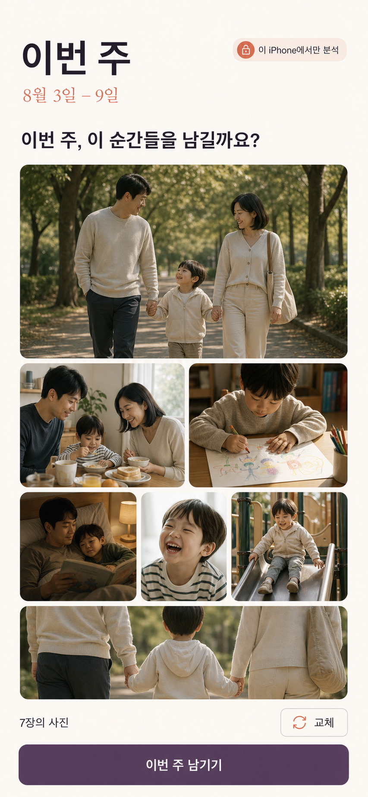
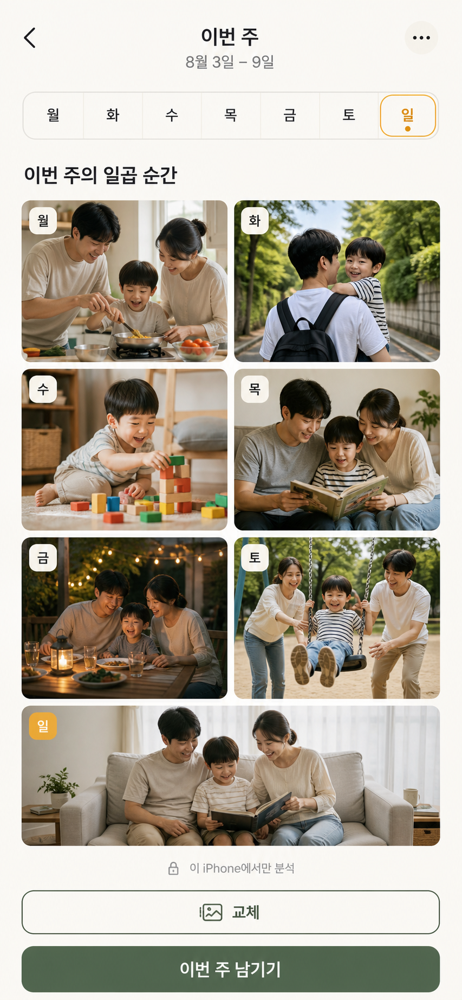
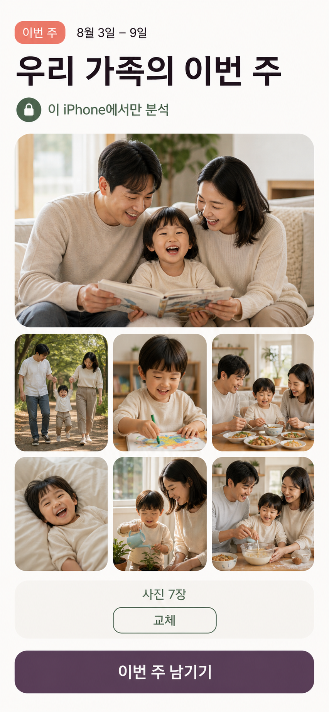
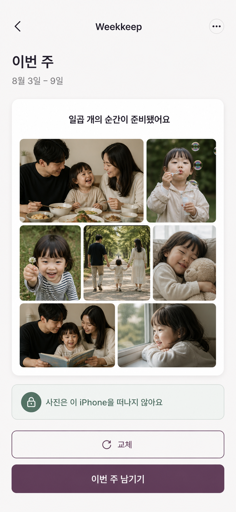
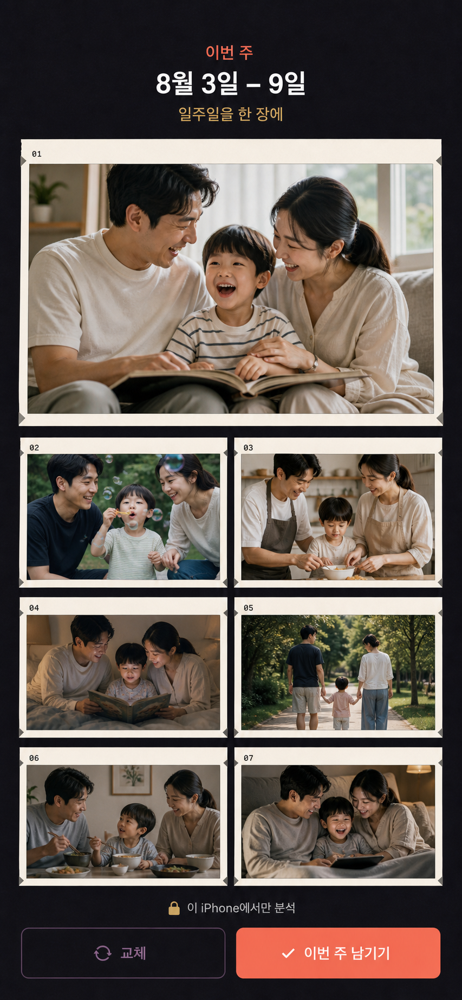

# Weekkeep Visual Direction Exploration

> **Deprecated exploration archive — 구현 금지.** 최종 기준은 [Design SSOT](../README.md)와 [App Screens V2](../app-screens-v2/README.md)입니다.

| 항목 | 값 |
|---|---|
| 생성일 | 2026-08-05 |
| 상태 | Deprecated |
| 역할 | Exploration archive |
| 생성 방식 | OpenAI built-in `image_gen` |
| 공통 화면 | Weekly Review, 7 photos |

## 조사한 인접 제품

| 제품 | 관찰한 강점 | Weekkeep이 가져올 것 | 가져오지 않을 것 |
|---|---|---|---|
| [FamilyAlbum](https://family-album.com/) | 큰 사진, 날짜 자동 정리, 가족 모두가 이해하는 단순함 | 친근한 정보 위계와 privacy 신뢰 | 공유 feed, 댓글, 월 단위 무한 timeline |
| [Qeepsake](https://qeepsake.com/) | 부모 부담을 줄이는 prompt, collage, 실제 책의 감성 | ‘기록을 완성하게 돕는’ 따뜻한 언어 | 질문/글쓰기/마일스톤 중심 구조 |
| [Once Upon](https://onceupon.photo/) | Scandinavian photo-book 절제, autofill, 명확한 replace | 사진 중심 editorial layout, 자동 초안+교체 | 인쇄 상품 편집/checkout UI |
| [Retro](https://apps.apple.com/us/app/retro-photos-with-friends/id6443709020) | weekly rhythm, no-pressure, 아름다운 recap | 일주일 단위와 가벼운 완료감 | social graph, likes, chat, postcard |
| [Day One](https://dayoneapp.com/guides/day-one-ios/journal-views-in-day-one-for-ios/) | List/Calendar/Media의 안정된 archive 구조 | native iOS hierarchy와 장기 열람성 | 텍스트 editor와 복잡한 metadata |
| [Apple Journal](https://www.apple.com/newsroom/2023/12/apple-launches-journal-app-for-reflecting-on-everyday-moments/) | on-device suggestion, privacy, focused cards | trusted suggestion-card architecture | 화면/브랜드의 직접 모방 |
| [1 Second Everyday](https://help.1se.co/en/articles/966670-what-is-1se) | 하루 하나라는 즉시 이해되는 시간 제약 | 7일 rhythm의 시각적 신호 | 매일 반드시 한 장이라는 강제 |

## 비교 기준

- Weekkeep의 ‘주간 7장’ 약속이 바로 보이는가?
- 가족 사진 제품에 필요한 신뢰가 느껴지는가?
- 피곤한 부모가 1분 안에 이해하고 행동할 수 있는가?
- 기존 baby album과 구별되는가?
- SwiftUI와 접근성 기준으로 현실적으로 구현 가능한가?

## 1. Quiet Editorial Album

Once Upon의 절제된 photo-book 감성과 Day One의 읽기 좋은 hierarchy를 Weekkeep에 맞게 재해석했습니다.

장점:

- 사진이 가장 먼저 보이고 브랜드가 프리미엄하게 느껴짐
- 기존 Design Guide의 Cream/Ink/Plum과 가장 잘 일치
- App Store screenshot과 랜딩 페이지에서 강함

위험:

- 감성은 좋지만 interaction signature가 약할 수 있음
- hero+2+3+1 mosaic의 responsive/VoiceOver 설계 필요

판정: **Visual language 1순위**

## 2. Seven-Day Rhythm

1SE의 시간 제약과 calendar의 스캔성을 가져와 월–일 rhythm 자체를 제품 signature로 만들었습니다.

장점:

- ‘일주일’과 ‘7장’이 가장 빨리 이해됨
- 매주 돌아오는 ritual을 시각적으로 기억하기 쉬움
- 주차 전환과 archive navigation으로 확장 가능

위험:

- 현재 PRD는 매일 한 장을 보장하지 않으므로 사진에 월–일을 1:1로 붙이면 거짓 정보가 됨
- 일별 빈 상태가 생기면 사용자가 ‘사진을 덜 찍었다’는 압박을 받을 수 있음

판정: **상단의 7-dot/ribbon만 차용**, 사진별 요일 강제는 제외

제품 계약 반영(2026-08-05): ribbon의 월–일은 사용자가 매일 해야 할 일이나 사진 1장씩을 뜻하지 않고, **이미 끝난 원본 주의 날짜 범위**만 나타냅니다. 다음 월요일 20:30 리마인더를 특정 요일 dot의 성취 상태로 강조하지 않으며, streak·일별 빈칸도 만들지 않습니다. 위 생성 이미지는 방향 탐색 기록이고 실제 화면 카피·상태는 최신 PRD/IA를 따릅니다.

## 3. Warm Private Family Album

FamilyAlbum의 즉시 이해되는 큰 사진과 Qeepsake의 따뜻함을 더 성숙한 palette로 정리했습니다.

장점:

- 부모와 조부모 모두 가장 쉽게 이해할 가능성
- 큰 touch target과 단순한 CTA로 접근성 우수
- privacy 메시지가 명확함

위험:

- generic family/baby album처럼 보일 가능성
- Weekkeep만의 ‘주간 ritual’보다 가족 사진 자체가 브랜드를 압도

판정: **접근성 참고안**, 최종 브랜드 베이스로는 차별성 부족

## 4. Private Journal Cards

Apple Journal의 privacy-first suggestion card와 Day One의 안정된 archive 감각을 직접 복제하지 않고 구조 원리만 사용했습니다.

장점:

- 무엇이 하나의 주간 기록인지 경계가 명확함
- native iOS에 가장 자연스럽고 구현 위험이 낮음
- permission, partial result, error, paywall을 같은 card system으로 확장하기 좋음
- accessibility와 Dynamic Type 대응이 가장 쉬움

위험:

- 그대로 쓰면 Apple 앱처럼 보이고 브랜드 고유성이 약해질 수 있음
- card가 한 겹 더 생겨 사진 면적이 1안보다 작음

판정: **Interaction architecture 1순위**

## 5. Weekly Contact Sheet

Retro의 주간 recap 정서와 사진가의 contact sheet를 합쳐 7장을 하나의 완결된 작품처럼 보이게 했습니다.

장점:

- 다섯 안 중 시각적 signature가 가장 강함
- 01–07 구조가 ‘고른 7장’을 명확하게 만듦
- dark mode와 marketing visual로 기억에 남음

위험:

- 밝고 포근한 가족 앱보다 차갑고 사진 전문가용처럼 보일 수 있음
- 작은 frame number와 dark UI는 피곤한 부모에게 인지 부담
- 화면 전체가 contact sheet라 상태/권한/error 확장성이 약함

판정: **Dark mode·launch visual 참고**, 기본 UI로는 비추천

## 평가표

5점 만점의 초기 제품 판단이며 사용자 테스트 전 가설입니다.

| 방향 | 핵심 약속 | 부모 친화 | 신뢰 | 차별성 | 구현/접근성 | 종합 |
|---|---:|---:|---:|---:|---:|---:|
| 1. Quiet Editorial | 4 | 4 | 4 | 5 | 4 | 4.2 |
| 2. Seven-Day Rhythm | 5 | 3 | 4 | 5 | 3 | 4.0 |
| 3. Warm Family Album | 4 | 5 | 5 | 3 | 5 | 4.4 |
| 4. Private Journal Cards | 5 | 4 | 5 | 4 | 5 | 4.6 |
| 5. Weekly Contact Sheet | 4 | 3 | 4 | 5 | 3 | 3.8 |

## 추천 방향

### `Direction 1 × Direction 4 + Direction 2의 작은 signature`

- 기본 구조: 4안의 **하나의 weekly card와 native state architecture**
- 시각 언어: 1안의 **Cream/Ink/Plum, 넓은 여백, editorial photo mosaic**
- 고유 장치: 2안의 **완료된 원본 주를 나타내는 월–일 7-dot ribbon**, 단 사진·행동과 요일을 1:1로 묶지 않음
- accessibility: 3안의 **큰 CTA와 분명한 privacy 상태**
- dark mode/marketing: 5안의 **contact-sheet rhythm을 제한적으로 활용**

이 조합은 Weekkeep을 baby-album처럼 보이지 않게 하면서도 Apple Journal의 모방으로 끝나지 않고, ‘일주일을 7장으로 남긴다’는 고유 약속을 가장 정확하게 보여줍니다.

## 당시 제안했던 다음 검증

1. 추천 조합으로 `Welcome / Analysis / Weekly Review / Weeks` 4화면 제작
2. 5명 부모에게 1안·4안·추천 조합 3개만 blind test
3. 측정: 15초 제품 이해, 교체 발견 시간, privacy 이해, 선호 이유
4. 결과를 `docs/05-DESIGN-GUIDE.md`에 최종 방향으로 반영

위 항목은 탐색 당시의 계획이며 현재 구현 계획을 소유하지 않습니다.

## 재현

생성에 사용한 전체 prompt는 [PROMPTS.md](PROMPTS.md)에 보존했습니다.
