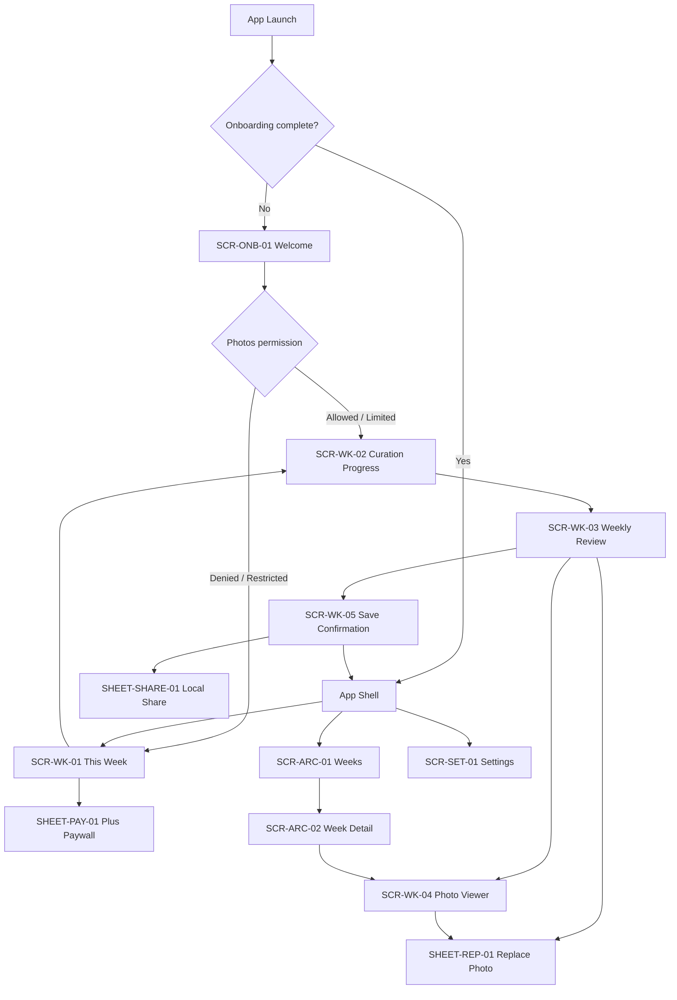
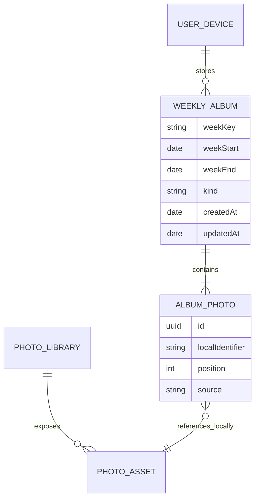

# Weekkeep Information Architecture

| 항목 | 값 |
|---|---|
| 버전 | 0.6-approved |
| 기준 문서 | [PRD](01-PRD.md), [Use Cases](02-USE-CASES.md) |
| 상태 | Approved |
| 플랫폼 | iPhone portrait-first |

## 1. IA 목표

Weekkeep의 구조는 ‘기능이 많은 사진 앱’이 아니라 **매주 하나의 일을 끝내는 앱**처럼 느껴져야 합니다.

- 첫 실행에서 한 번의 CTA로 첫 결과까지 갑니다.
- 반복 실행의 첫 화면은 현재 해야 할 일 또는 완료 상태입니다.
- 과거 기록은 주차별 보관함으로 분리합니다.
- 권한·구매·지원은 Settings에 모읍니다.
- 분석, 교체, 결제는 맥락을 잃지 않는 transient flow로 구성합니다.

## 2. 최상위 구조



## 3. App Shell

### 탭

| 순서 | ID | 사용자 라벨 | 역할 | 기본 아이콘 방향 |
|---|---|---|---|---|
| 1 | `TAB-WEEK` | 이번 주 / This Week | 최신 주간 기록 상태와 핵심 CTA | `CMP-13 SemanticTabIcon` calendar/week silhouette |
| 2 | `TAB-ARCHIVE` | 지난 기록 / Saved weeks | 저장된 기록 탐색 | `CMP-13 SemanticTabIcon` stacked album/pages silhouette |
| 3 | `TAB-SETTINGS` | 설정 / Settings | 권한, 알림, Plus, 지원 | `CMP-13 SemanticTabIcon` adjustment-sliders silhouette |

각 탭은 독립 `NavigationStack`을 갖습니다. 탭 전환 후 이전 drill-down 상태는 같은 세션 동안 보존하되, paywall이나 replacement sheet는 보존하지 않습니다.

### 탭 규칙

- 첫 실행 흐름에서는 tab bar를 숨깁니다.
- 온보딩 완료 후 기본 탭은 `TAB-WEEK`입니다.
- 알림 deep link는 `TAB-WEEK`을 선택한 뒤 대상 상태를 엽니다.
- 저장 기록 deep link는 `TAB-ARCHIVE`를 선택한 뒤 상세로 이동합니다.
- Settings에서 권한을 바꾸고 돌아와도 기존 선택 탭을 유지합니다.
- 세 tab icon의 Plum semantic silhouette은 서로 달라야 하며, This Week는 calendar/week, Weeks는 stacked album/pages, Settings는 adjustment sliders로 즉시 구분되어야 합니다.
- bottom tab bar의 각 icon은 고유한 Plum semantic silhouette만 렌더링합니다. decorative exact-seven rainbow signature는 tab bar에서 제외하고, 의미 있는 SevenStitchRail/vertical binding surface에서만 D-030 계약을 적용합니다.

## 4. 콘텐츠 모델과 관계



Weekkeep은 사진 바이너리를 소유하지 않습니다. `AlbumPhoto`는 Photos의 로컬 자산을 참조하므로 원본 삭제·권한 변경 시 unavailable 상태가 될 수 있습니다. 주차·선택 순서는 현재 앱 설치의 SwiftData에만 저장하며 앱 관리형 백업이나 새 기기 복원을 제공하지 않습니다.

## 5. 화면 인벤토리

| ID | 화면/표면 | 유형 | 핵심 목적 | 주요 Use Case |
|---|---|---|---|---|
| `SCR-ONB-01` | Welcome | Full screen | 가치·프라이버시 설명 후 Photos 요청 | UC-01, UC-02 |
| `SCR-WK-01` | This Week | Tab root | 현재 주간 상태와 하나의 다음 행동 | UC-03, UC-05 |
| `SCR-WK-02` | Curation Progress | Push/full screen | 분석 진행, 대기, 취소 | UC-04, UC-05, UC-12 |
| `SCR-WK-03` | Weekly Review | Push | 최대 7장 검토·저장 | UC-04, UC-06, UC-07 |
| `SCR-WK-04` | Photo Viewer | Full-screen cover | 사진 한 장 확대·탐색 | UC-06, UC-08 |
| `SCR-WK-05` | Save Confirmation | In-flow destination | 완료 보상과 다음 행동 | UC-07, UC-09 |
| `SHEET-REP-01` | Replace Photo | Bottom sheet/full height | 한 위치의 후보 교체 | UC-06 |
| `SHEET-SHARE-01` | Weekly Album Share | Bottom sheet/full height | Story/Post local artifact 준비·공유 | UC-07, UC-08 |
| `SHEET-NOT-01` | Notification Primer | Bottom sheet | 가치 설명 후 알림 권한 요청 | UC-09 |
| `SHEET-PAY-01` | Plus Paywall | Full-screen modal surface | 유료 가치, 구매, 복원 | UC-10, UC-11 |
| `SCR-ARC-01` | Weeks | Tab root | 저장한 주를 최신순 탐색 | UC-08 |
| `SCR-ARC-02` | Week Detail | Push | 한 주의 사진 다시 보기 | UC-08 |
| `SCR-SET-01` | Settings | Tab root | 권한·알림·Plus·지원 진입 | UC-03, UC-11, UC-13 |
| `SCR-SET-03` | Help & Support | Push | 도움말, 문의, 약관, 개인정보 처리방침, 버전 | UC-13 |

시스템 Photos/Notifications/App Store 팝업과 iOS Settings는 Weekkeep 화면 ID를 부여하지 않습니다.

## 6. 핵심 화면 상세

### `SCR-ONB-01` Welcome

시각 계약:

- upper-left brand mark는 `design/brand/weekkeep-wordmark.*`에서 파생한 canonical lowercase wordmark-only image resource입니다. Text로 재식자하거나 AppIcon을 대체하지 않습니다.
- wordmark 바로 아래 rail은 항상 정확히 7개 slot이며 `D-030`의 index별 muted rainbow를 사용합니다. 이 rail은 사진 7장의 결과 예시를 보조하고 요일·streak를 뜻하지 않습니다.
- explanatory copy 아래 preview는 공유 `FixturePhotoStory` vocabulary를 사용합니다. onboarding은 하나의 warm paper/cream card 안에 vertical exact-seven binding과 일곱 개의 승인된 synthetic fixture image를 사진 중심으로 배치하고, Ready/Plus는 같은 hero+2+4 mosaic의 compact rail variant를 사용합니다. faux-content capsule bar, overlapping card stack, gradient/SF Symbol fake-photo art는 사용하지 않습니다. fixture는 user photo로 취급하지 않으며 CTA나 권한 흐름의 대체가 아닙니다 (`D-035`).

정보 우선순위:

1. 최대 7장의 실제 camera-roll 사진처럼 보이는 결과 예시
2. `사진은 많은데, 정리할 시간은 없으니까.`
3. `가장 최근 완료된 월요일부터 일요일까지의 한 주로 시작해 최대 7장의 순간을 골라드려요. 마음에 들지 않는 사진만 바꿔보세요.`
4. privacy badge: `사진 고르기는 이 iPhone 안에서 이뤄져요`
5. primary CTA: `첫 주 추억 고르기 / Choose your first week`
6. secondary text link: `사진 접근을 어떻게 사용하나요?`

상태:

- `idle`: CTA 활성
- `requestingPermission`: CTA progress, 중복 탭 차단
- `returningFromSystem`: 권한 결과 확인

금지:

- 페이지 indicator가 있는 다중 carousel
- 알림 요청
- paywall 또는 가격
- ‘AI가 아이를 찾아요’ 표현

### `SCR-WK-01` This Week

이 화면은 하나의 레이아웃이 아니라 `WeekRootStateReducer`가 반환하는 **정확히 하나의 상태**로 그립니다. 표의 숫자는 평가 우선순위이며, 아래 상태의 조건에는 ‘더 높은 우선순위 상태가 모두 거짓’이라는 조건이 포함됩니다.

| 우선순위 | 상태 | 배타적 조건 | 제목 방향 | Primary CTA | Secondary |
|---:|---|---|---|---|---|
| 1 | `loading(stage)` | 현재 분기에서 다음으로 필요한 input이 아직 확인 중 | 지난주를 확인하고 있어요 | 없음 | 없음 |
| 2 | `permissionBlocked(reason)` | Photos가 denied 또는 restricted | 사진 접근이 필요해요 | 설정 열기(denied) | 개인정보 보기 |
| 3 | `recoverableError(kind)` | root 판단에 필요한 권한 외 조회가 실패 | 지난주를 불러오지 못했어요 | 다시 시도 | 지원 |
| 4 | `welcomePending(accessScope)` | Photos 사용 가능 + Welcome 미저장 | 첫 주 추억을 골라볼까요? | 첫 주 추억 고르기 | 없음 |
| 5 | `preRegularWaiting` | Welcome 저장 + 아직 완료된 첫 Regular target 없음 | 다음 기록이 곧 열려요 | 저장한 주 보기 | 앨범 공유하기 |
| 6 | `saved(albumID)` | 현재 target 존재 + 같은 `weekKey` 저장 기록 존재 | 지난주를 남겼어요 | 기록 보기 | 지난 기록 보기 |
| 7 | `noEligiblePhotos(accessScope)` | 현재 target 미저장 + 접근 가능한 적격 사진 0장 | 지난주에는 남길 사진이 없어요 | limited면 사진 선택 관리, full이면 다시 확인 | 개인정보 보기 |
| 8 | `entitlementLocked` | 현재 target 미저장 + 적격 사진 1장 이상 + 무료 한도 도달 + Plus 비활성 확인 | 지난 두 주를 남겼어요 | Plus로 계속하기 | 지난 기록 보기 |
| 9 | `ready(accessScope, photoCount)` | 현재 target 미저장 + 적격 사진 1장 이상 + 생성 권한 있음 | 지난주의 순간을 남겨볼까요? | 지난주 추억 고르기 | 날짜/접근 상태 |

상태별 본문은 다음처럼 구분합니다. Welcome은 가장 최근 완료된 월–일 주를 처음 남기는 맥락이고, 완료 주에 적격 사진이 0장일 때만 fallback copy가 최근 7일을 명시합니다. Regular는 완료된 지난주를 다시 보는 맥락입니다.

- `welcomePending`: completed week 설명을 사용하고, `rollingSevenDayFallback`일 때만 `그 주에 적격 사진이 없어 최근 7일에서 최대 7장의 순간을 확인해요.`를 사용합니다.
- `ready`: `지난주 사진에서 다시 보고 싶은 순간을 최대 7장 골라드려요.`

`preRegularWaiting`에서만 아직 첫 Regular target을 기다립니다. compact header의 brand/stitch signature가 있으므로 body에 두 번째 SevenStitchRail을 렌더링하지 않습니다. 최신 저장 앨범 snapshot의 실제 cover photo 또는 truthful placeholder, 앨범 날짜 범위, 정확한 다음 가능일, `저장한 주 보기`, `앨범 공유하기` action을 normal scroll flow에 둡니다. 앨범/cover가 없으면 보기 navigation은 유지하고, 모든 사진이 unavailable일 때만 share를 비활성화합니다. 정확한 날짜는 schedule cue이며 countdown/streak가 아닙니다.

초기 프레임과 하단 경계:

- `welcomePending`과 `ready`의 state-specific primary CTA는 `ReadyStateView` 안에서 제목·본문 다음, explanatory photo story 전에 normal document flow로 렌더링하며 첫 프레임부터 hittable해야 합니다.
- CTA는 `CMP-01`의 solid Plum button만 사용하고 safe-area footer, overlay dock, 별도 카드·mockup bar를 만들지 않습니다.
- photo story, 실제 photo count, limited-access notice, PrivacyBadge는 계속 normal scroll content로 유지하며, `WeekkeepTabHostSpacing.bottomScrollClearance`라는 실제 content runway를 통해 마지막 콘텐츠까지 native tab bar 위에서 각각 완전히 보이게 합니다.
- CTA는 `welcomePending`/`ready`에서만 렌더링합니다. loading, permission, waiting, saved, empty, locked 상태와 `SCR-WK-02` 이후 route surface의 기존 행동은 바꾸지 않습니다.

### `WeekRootStateReducer` 계약

```text
if permission is pending                                  → loading(permission)
else if Photos is denied/restricted                       → permissionBlocked
else if local album/target snapshot is pending            → loading(localState)
else if local album/target snapshot failed                → recoverableError
else if Welcome album is not saved                        → welcomePending
else if latest eligible Regular target does not exist     → preRegularWaiting
else if album exists for target.weekKey                   → saved
else if eligible photo query is pending                   → loading(photos)
else if eligible photo query failed                       → recoverableError
else if eligiblePhotoCount == 0                            → noEligiblePhotos
else if creation access is pending                        → loading(entitlement)
else if creation access failed                            → recoverableError
else if free limit reached and Plus is confirmed inactive → entitlementLocked
else                                                       → ready
```

Reducer 불변식:

- 동일 snapshot에서 두 상태가 동시에 참일 수 없습니다.
- limited 접근은 blocker가 아니라 `accessScope`이며, 사진이 있으면 `ready`, 없으면 `noEligiblePhotos`입니다.
- 사진이 없는 사용자에게 paywall을 먼저 보여주지 않습니다.
- reducer는 탐색·알림·구매·저장 side effect를 실행하지 않고 상태만 반환합니다.
- `unknown` entitlement를 `inactive`로 간주하지 않습니다. 확인이 끝날 때까지 `loading`, 조회 실패 시 `recoverableError`입니다.
- 아직 필요하지 않은 photo count나 entitlement 때문에 앞선 명확한 상태를 지연시키지 않습니다. 예를 들어 denied 상태에서는 entitlement를 기다리지 않고 즉시 `permissionBlocked`를 반환합니다.

### 주간 eligibility 규칙

1. completed-calendar-week Welcome을 저장할 때 `regularCycleStartsAt = album.weekEnd`로 설정합니다. rolling fallback과 기존 legacy rolling Welcome은 저장 시점 다음 월요일 규칙을 사용하고 persisted cycle은 보존합니다. 이는 첫 Regular Week의 **source week start**입니다.
2. `weekStart >= regularCycleStartsAt`인 첫 전체 캘린더 주가 끝나기 전에는 `preRegularWaiting`입니다. Welcome Week와 겹치는 직전 완료 주를 다시 제안하지 않습니다. 다음 가능일은 그 source week의 eligibleFrom을 exact local date로 보여줍니다.
3. Regular Week의 사진 범위는 월요일 00:00–일요일 23:59이며, 범위가 완전히 끝난 다음 월요일 00:00부터 `ready`입니다.
4. `ready`는 다음 일요일 23:59까지 유지됩니다. 월요일 20:30 알림은 진입을 돕는 리마인더일 뿐 eligibility gate가 아닙니다.
5. Regular Week의 분석 cutoff는 완료된 주의 nominal end로 고정하며 현재 진행 중인 주 사진을 섞지 않습니다.
6. 같은 `weekKey`를 저장하면 `saved`가 되고, 더 최신 Regular target이 eligible해질 때까지 그 상태를 유지합니다.
7. 완료 창을 놓친 뒤 새 주가 끝나면 가장 최근 완료 주 하나만 제안합니다. backlog, missed count, streak loss는 표시하지 않습니다.
8. 완료 창 안에서 진입한 분석·검토 flow는 `weekKey`를 고정합니다. flow 도중 다음 월요일이 되어도 화면을 새 대상으로 바꾸지 않습니다.

이 규칙은 `WeekEligibilityPolicy`의 단일 source of truth로 구현하고 테스트합니다.

### `SCR-WK-02` Curation Progress

정보 우선순위:

1. 작은 사진 mosaic 또는 중립적인 progress visual
2. 제목/본문: `소중한 순간을 고르고 있어요` / Regular는 `지난주의 사진에서 다시 보고 싶은 순간을 찾고 있어요.`, Welcome은 고정된 completed week 또는 truthful fallback을 설명합니다.
3. 현재 단계: `사진을 살펴보는 중` → `비슷한 사진을 정리하는 중` → `한 주의 기록을 정리하는 중`
4. determinate가 가능한 경우 `살펴본 사진 x/y`
5. 보조 문구: `사진 고르기는 이 iPhone에서 처리해요`
6. secondary action: `취소`

상태:

- `fetchingAssets`
- `prefiltering` (metadata scan ≤500, Vision candidate shortlist ≤21)
- `downloadingFromICloud(completed,total)`
- `analyzing(completed,total)`
- `ranking`
- `partialSuccess(skippedCount)`
- `cancelled`
- `failed(errorKind)`

가짜 퍼센트나 완료 시간 예측은 표시하지 않습니다.

### `SCR-WK-03` Weekly Review

정보 우선순위:

1. compact header cluster: back action + 주차/날짜 범위 + 정확히 7개의 restrained rainbow signature
2. Regular Week는 `지난주, 이 순간들을 남길까요?`, Welcome Week는 `이 순간들을 남길까요?`; 실제 장수는 본문에 표시하며 최대 7입니다
3. `SevenPhotoGrid` 또는 실제 개수 grid
4. 현재 선택 photo와 `이 사진 바꾸기`; 각 셀의 직접 접근 가능한 viewer·교체 action
5. `n장의 사진` 및 제한/부분 결과 안내
6. grid와 helper/replacement action, quiet privacy note 뒤의 normal-flow primary CTA: `사진 n장 남기기`

본문은 `이번 주에 남길 순간 n장을 골라봤어요. 마음에 들지 않는 사진만 바꿔보세요.`이며, helper는 `바꾸고 싶은 사진을 눌러주세요.`입니다.

레이아웃:

- header는 기존 ScreenHeader와 별도 date/stitch row를 합친 하나의 semantic cluster로 구현합니다. 두 번째 bar, 중복 header, 큰 dead spacing을 만들지 않습니다.
- 7장: 가용 폭을 모두 쓰는 16:10 hero 1장 + 1:1 중간 2장 + 1:1 하단 4장 조합이 production 기본이며, 모든 row gap은 `space.2`(8pt)입니다.
- 1–6장: 빈 slot을 점선 placeholder로 채우지 않고 실제 장수에 맞는 adaptive grid
- 사진 선택 순서는 촬영 시간순, hero는 첫 사진이 아니라 품질 상위 커버를 별도 선택 가능
- cover가 시간순 첫 자산과 달라도 접근성 순서는 촬영 시간순을 유지
- 마지막 4개 cell의 touch target이 44pt 미만이거나 content size·기기 폭 조건을 만족하지 못하면 2-column adaptive layout으로 전환합니다.
- accept-as-is가 primary path입니다. grid가 나타난 뒤 교체 없이 CTA 한 번으로 저장할 수 있어야 합니다.
- 저장 CTA는 safe-area inset이나 overlay dock이 아니라 grid 전체와 helper/replacement action, privacy note가 끝난 뒤 normal scroll content에 놓입니다. 사진 collage를 가리거나 중간에서 시각적으로 자르지 않습니다.
- 모든 scroll position에서 status-bar/system indicator 아래로 readable content가 들어가지 않도록 같은 Cream surface가 unsafe top underlap을 보이지 않게 가립니다. lower-action frame은 editorial title/copy가 안전 경계 아래에 온전히 보이거나 위로 완전히 가려진 상태만 허용하며, 중간에 잘린 headline/copy를 캡처하지 않습니다.
- `교체`는 원하지 않는 사진에만 쓰는 secondary action이며, 처음부터 7장을 직접 선택하는 mode는 제공하지 않습니다.
- 반복 주 검토의 활성 조작 목표는 중앙값 60초 이하이며 분석 대기와 background 시간은 제외합니다.

상호작용 계약 (`D-029`):

1. `selectedIndex == nil`에서 photo를 탭하면 해당 index를 선택하고 `이 사진 바꾸기`를 노출합니다. viewer는 열지 않습니다.
2. 다른 photo를 탭하면 선택 대상만 바뀝니다.
3. 선택된 같은 photo를 다시 탭하면 그 index로 `SCR-WK-04`를 엽니다.
4. 저장 CTA는 `selectedIndex`와 무관하게 항상 accept-as-is 경로를 유지합니다.
5. VoiceOver custom action `크게 보기`와 `사진 교체`는 이 순차 gesture를 우회해 각 destination을 직접 엽니다.
6. replacement 직후에는 같은 visual slot만 crossfade하고 다른 photo를 재배치하지 않습니다. 저장 transition에서 최종 set을 촬영 시간순으로 정규화합니다.

상태:

- `reviewing(selectedIndex: Int?)`
- `viewerPresented(index)`
- `replacementPresented(index)`
- `saving`
- `saveFailed`
- `assetBecameUnavailable`

### `SCR-WK-04` Photo Viewer

- Light appearance의 full-screen cover이며 현재 위치 `n / total`, 닫기, 큰 사진, thumbnail rail을 제공합니다.
- Review에서는 선택된 photo의 두 번째 tap 또는 접근성 `크게 보기` action으로 열고, Archive detail에서는 photo 한 번 tap으로 엽니다.
- 좌우 swipe와 thumbnail tap은 1–7장 사이를 이동하며 현재 index를 동기화합니다.
- `이 사진 바꾸기`는 현재 viewer index를 `SHEET-REP-01`의 교체 대상으로 전달합니다.
- Review로 닫으면 viewer의 마지막 current index를 선택 index로 반영하고 grid scroll 위치를 복원합니다. Archive detail로 닫으면 선택 state 없이 scroll 위치만 복원합니다.
- viewer 자체에는 edit, like, filter, comment, metadata overflow가 없습니다. 저장된 앨범의 local share는 Save Confirmation 또는 Archive detail의 전용 action에서 시작합니다.

### `SHEET-REP-01` Replace Photo

- 제목: `어떤 사진으로 바꿀까요?`
- 첫 상태는 선택 photo와 display timezone 기준 같은 calendar day의 unused 후보만 동일 크기 2-column grid로 표시
- same-day 후보가 없으면 따뜻한 설명과 `다른 날 사진 보기` 명시적 action만 표시
- same-day 후보가 있으면 하단에 다른 날짜 보기 secondary disclosure를 둘 수 있지만 자동으로 섞지 않음
- opt-in 뒤에는 다른 날짜를 day heading으로 group하고 날짜를 각 후보가 알 수 있게 표시
- 각 사진에 촬영 날짜/시간을 보조로 제공하되 VoiceOver가 읽을 수 있게 함
- 선택 즉시 dismiss하되 Reduce Motion을 존중
- 후보 0이면 grid 대신 설명과 닫기만 표시
- Photos 전체 라이브러리 picker는 V1 교체 흐름에 포함하지 않음

### `SCR-WK-05` Save Confirmation

- 저장된 7장 또는 실제 장수를 60–80ms 간격의 짧은 순차 reveal로 다시 보여줍니다.
- 작은 화면이나 큰 글자에서는 completion content가 normal scroll로 이어지며 share/view/done action이 항상 도달 가능해야 합니다.
- reveal 전체는 약 1초 안에 끝나며 추가 탭을 요구하지 않습니다. Reduce Motion에서는 짧은 fade 한 번으로 대체합니다.
- Regular Week 제목: `지난주가 작은 앨범이 됐어요.`
- 보조 문구: `평범한 한 주도, 나중에 다시 꺼내 볼 수 있는 기록이 됐어요.`
- primary: `이 앨범 공유하기` (local share preparation)
- secondary: `기록 보기`
- tertiary: `완료`
- 최초 저장이고 알림 미결정이면 다음으로 `SHEET-NOT-01`을 제안하고 exact next eligible date를 함께 보여줍니다. 이미 알림 상태가 결정되었거나 primer를 본 경우에는 system prompt를 다시 열지 않고 저장 완료로 진행합니다.
- confetti, streak, 점수는 사용하지 않습니다.

### `SHEET-SHARE-01` Weekly Album Share

- 저장된 실제 PhotoKit display image로 기기에서만 renderer를 실행합니다.
- format 선택: Story 9:16 `1080×1920`, Post 4:5 `1080×1350`
- preview, loading, retry/error, accessible label, local-only privacy explanation을 모두 제공합니다.
- 7장은 canonical wordmark, warm paper, date range, optional cumulative serial label, hero+2+4, exact seven muted stitch palette, localized conversational footer prompt, restrained `Made with Weekkeep` signature를 사용합니다. 1–6장은 실제 사진만 adaptive layout에 배치합니다. serial label은 `Our family · week N` / `우리 가족의 N번째 주`이고 ordinal을 확인하지 못하면 공간 없이 생략합니다.
- share button을 명시적으로 누르기 전에는 native share sheet를 열지 않습니다. temporary file은 share activity가 끝나면 정리합니다.
- native share items는 local image artifact를 첫 항목으로 두고 localized parent invitation과 canonical Apple install URL을 separate native items로 제공합니다. image-only destination은 이미지 중심으로, link-capable destination은 iOS가 허용하는 범위에서 text와 URL을 사용합니다. private destination identifier에 의존하지 않습니다.
- recipient, destination, filename, location, score, child/family identity, analytics payload를 artifact나 analytics에 넣지 않습니다. footer prompt는 `How was your family's week?` / `너희 가족의 이번 주는 어땠어?`로 7-stitch 위에만 배치하며, V1 이미지에는 public install URL, QR code, loud ad overlay를 그리지 않습니다. 기존의 restrained `Made with Weekkeep` branding을 유지합니다. 이 share contract는 historical build 6에는 포함되지 않았고, 현재 제출된 build 7의 release evidence에 반영되어 있으며 공개 릴리스 전 URL이 live라고 주장하지 않습니다.

### `SHEET-NOT-01` Notification Primer

- 제목: `다음 기록을 남길 때 알려드릴까요?`
- 설명: `월요일 저녁, 여유가 될 때 다시 볼 수 있도록 알려드릴게요.`
- exact cue: `다음 기록 가능일: {localized exact date}`
- primary: `알림 받을게요`
- secondary: `지금은 괜찮아요`
- 알림 본문: `월요일 저녁, 여유가 될 때 다시 볼 수 있도록 알려드릴게요.`
- `7장이 준비됐어요`처럼 foreground 분석이 끝났다고 주장하는 문구는 사용하지 않습니다.
- 한 번 처리한 primer를 반복 표시하지 않으며, notification deep link는 최신 eligible weekly state로 이동합니다.

### `SCR-ARC-01` Weeks

목록 hierarchy:

1. navigation title `지난 기록`
2. 연도 section(기록 12개 이상일 때만)
3. `WeekRow`: 커버, 현지화 날짜 범위, 사진 수
4. 누락 사진이 있으면 작은 텍스트 상태; 경고색 남용 금지

Empty state:

- 제목: `첫 주를 남겨보세요.`
- 설명: `사진 몇 장이면 첫 기록을 남길 수 있어요.`
- CTA: `이번 주로 가기`

### `SCR-ARC-02` Week Detail

- inline title은 현지화된 날짜 범위
- 커버와 모든 사진을 시간순으로 표시
- 누락 자산은 고정 aspect placeholder
- top-bar local share action으로 `SHEET-SHARE-01`을 열 수 있음. 누락 사진이 전부면 action을 disabled 처리
- social feed, comments, likes, account, cloud upload, server rendering, overflow/edit/delete menu는 V1에 없음
- photo tap → `SCR-WK-04`

### `SHEET-PAY-01` Plus Paywall

이 ID는 기존 문서 추적성을 위해 유지하며, production에서는 gray sheet chrome 없는 item-driven full-screen modal surface로 표시합니다. 자체 close action으로 닫으면 정확한 이전 상태로 돌아가고, purchase/restore/loading/error 접근성과 기존 `WeeklySheet.paywall` routing semantics를 유지합니다.

정보 우선순위:

1. 이미 만든 두 주의 작은 결과/가치 회상
2. `매주 작은 앨범을 계속 남겨요.`
3. 포함 가치: 매주 남길 순간을 최대 7장 골라드림, 현재 앱에 남아 있는 기존 기록 열람은 이미 무료
4. RevenueCat 현지화 상품명과 Store 가격; KR 약 ₩29,000 같은 예상값은 production UI에 하드코딩하지 않음
5. primary purchase CTA
6. `구매 복원`, `약관`, `개인정보`, dismiss

`평생 이용권`은 Plus 기능의 구매 유형이지 기록의 영구 보존 약속이 아닙니다. 개인정보 링크에서 로컬 저장 한계를 구매 전에 확인할 수 있어야 합니다.

상태:

- `loadingOffering`
- `ready(product)`
- `purchasing`
- `pending`
- `failed`
- `restoring`
- `restoreAcknowledged`
- `confirmingEntitlement`
- `entitled`

가격을 로드하지 못하면 hard-coded 가격 CTA를 표시하지 않습니다.

### `SCR-SET-01` Settings

Section 순서:

1. `사진`: 정확히 하나의 status `SettingsValueRow`만 표시합니다. actionable 상태에서는 row 자체가 notDetermined의 Photos 요청 또는 full/limited/denied의 시스템 설정 이동을 실행하며, restricted에서는 정책 설명만 제공합니다.
2. `알림`: 정확히 하나의 status row만 표시합니다. 저장 기록이 0개이면 `첫 기록 저장 후` 상태와 필요한 설명만 표시하고 action은 숨깁니다. 저장 기록이 있으면 row 자체가 notDetermined의 권한 요청 또는 결정된 상태의 알림 설정 이동을 실행합니다.
3. `Weekkeep Plus`: 정확히 하나의 status row를 표시합니다. entitlement가 inactive일 때만 row가 paywall을 열고, active/unknown에서는 redundant paywall을 열지 않습니다. `구매 복원`은 active가 아닐 때만 별도 recovery action으로 표시합니다.
4. `Help & Support`: 정보 요약을 반복하지 않는 하나의 compact navigation row만 표시합니다.

V1에는 사용자 계정 section, 데이터 동기화 switch, 실험적 AI setting을 두지 않습니다.

### `SCR-SET-03` Help & Support

이 화면은 사용자 행동으로 이어지는 native `List`/`Section`만 제공합니다.

1. `Help`
2. `Contact us`
3. `Terms of Use`
4. `Privacy Policy`
5. 작은 app version footer

wordmark, stitch rail, tagline/body marketing copy, font acknowledgement, made-by copy, open-source license menu와 별도의 개인정보 설명 화면은 제공하지 않습니다. 로컬 저장·백업 한계 고지는 Archive와 Paywall의 해당 맥락에만 남깁니다.

## 7. 주요 흐름

### A. 첫 가치 경로

```text
SCR-ONB-01
  → Photos system prompt
  → SCR-WK-02
  → SCR-WK-03
  → (SHEET-REP-01, optional)
  → SCR-WK-05
  → (SHEET-SHARE-01, primary optional action)
  → (SHEET-NOT-01, first save only)
  → SCR-WK-01 / saved
```

### B. 반복 주간 경로

```text
Local notification or TAB-WEEK
  → SCR-WK-01 / ready
  → [free/Plus gate]
  → SCR-WK-02
  → SCR-WK-03
  → SCR-WK-05
  → (SHEET-SHARE-01, optional)
```

### C. 결제 경로

```text
SCR-WK-01 / entitlementLocked
  → SHEET-PAY-01
  → App Store purchase sheet
  → entitlement verification
  → dismiss
  → resume the exact weekKey at SCR-WK-02
```

### D. 권한 회복 경로

```text
SCR-WK-01 / permissionBlocked
  → iOS Settings
  → app foreground
  → authorization refresh
  → ready / noEligiblePhotos / permissionBlocked
```

## 8. 내비게이션 계약

### Push vs Sheet

| 대상 | 방식 | 이유 |
|---|---|---|
| 분석 진행 | Push/full screen | 핵심 task 단계, 뒤로 가기/취소 필요 |
| 검토 | Push | 핵심 task의 연속성 |
| 사진 확대 | Full-screen cover | 사진 집중, 빠른 dismiss |
| 교체 후보 | Sheet | 현재 grid 위치 맥락 보존 |
| local share preparation | Sheet | format 선택·preview·retry를 저장/상세 맥락 안에서 제공 |
| 알림 primer | Sheet | 첫 저장 직후, 아직 알림이 미결정일 때만 제공하는 선택 |
| paywall | Full-screen cover | gray sheet chrome 없이 닫으면 정확한 원래 상태로 복귀 |
| archive detail | Push | 계층 탐색 |
| help & support | Push | 설정에서 실제 지원 행동으로 이어지는 계층 |

### Back/dismiss 규칙

- 분석 화면 Back은 취소 confirmation 없이 즉시 취소하되, 작업 중임을 button label로 명확히 합니다.
- 검토 화면 Back은 초안이 바뀌었으면 `이 선택을 그만둘까요?` 확인을 1회 제공합니다.
- viewer dismiss는 진입한 Review/Archive의 index와 scroll 위치를 복원합니다.
- 교체 sheet dismiss는 변경 전 상태를 유지합니다.
- paywall dismiss는 무료 한도 상태로 돌아가며 과거 기록은 유지합니다.
- 저장 중에는 interactive dismiss를 잠시 막고, 2초 이상이면 progress label을 보여줍니다.

## 9. Deep Link 계약

| URI | 목적 | fallback |
|---|---|---|
| `weekkeep://weekly/current` | 최신 eligible week 또는 saved state | `SCR-WK-01` |
| `weekkeep://album/{weekKey}` | 저장된 특정 주 상세 | `SCR-ARC-01` + not found notice |
| `weekkeep://settings/photos` | Photos 설정 section | `SCR-SET-01` |
| `weekkeep://settings/notifications` | 알림 설정 section | `SCR-SET-01` |
| `weekkeep://plus` | Plus paywall | `SCR-WK-01` |

규칙:

- URL parameter에 photo asset identifier를 넣지 않습니다.
- 인증은 없지만 onboarding 미완료면 deep link를 pending으로 두고 Welcome부터 진행합니다.
- 존재하지 않는 weekKey는 archive root로 이동하고 비파괴 notice를 표시합니다.

## 10. 권한 상태 매트릭스

| Photos | Notification | 핵심 기능 | UI 원칙 |
|---|---|---|---|
| Full | any | 전체 동작 | 별도 badge 불필요 |
| Limited | any | 선택 자산으로 동작 | This Week/Settings에 `일부 사진` 표시 |
| Denied | any | 만들기 불가, 열람은 가능한 범위에서 유지 | 설정 CTA |
| Restricted | any | 만들기 불가 | 정책 제한 설명, 허위 CTA 금지 |
| Not determined | any | 아직 요청 전 | 권한 요청 CTA, Settings 회복으로 가장하지 않음 |
| Full/Limited | Not determined | 전체 동작 | 첫 저장 전 요청 금지 |
| Full/Limited | Denied | 전체 동작, reminder 없음 | 기능 제한 메시지 금지 |

## 11. Empty/Loading/Error 구분

| 유형 | 의미 | CTA 예시 |
|---|---|---|
| Empty | 데이터가 실제로 없음 | 이번 주로 가기 |
| Waiting | 아직 주간 루프 시점이 아님 | 없음 |
| Permission | 앱이 데이터에 접근할 수 없음 | denied: 설정 열기 / limited: 사진 선택 관리 / notDetermined: 권한 요청 / restricted: 정책 설명 |
| Loading | 작업 진행 중 | 취소 |
| Partial | 일부 데이터만 성공 | 이 사진들로 계속/다시 시도 |
| Recoverable Error | 같은 작업 재시도 가능 | 다시 시도 |
| Blocking Error | 외부 상태 변화 필요 | 설정/지원 |

한 상태를 다른 상태의 카피로 재사용하지 않습니다. 특히 `사진 없음`과 `권한 없음`은 반드시 구분합니다.

## 12. 접근성 탐색 구조

- 화면 제목이 첫 VoiceOver focus가 됩니다.
- 사진 grid는 촬영 시간순으로 읽고 `3월 8일 오후 2시 사진, 7장 중 3번째, 교체 가능`처럼 라벨링합니다.
- 사진 위 작은 icon button에만 의존하지 않고 custom action `크게 보기`와 `사진 교체`를 제공합니다. 이 action은 선택→재탭 순서를 요구하지 않습니다.
- progress는 의미 있는 단계가 바뀔 때만 announcement합니다.
- paywall 가격과 구매 단위를 하나의 읽기 순서로 묶습니다.
- dynamic type에서 tab label과 primary CTA가 잘리지 않아야 합니다.
- full-screen viewer는 현재 위치(`3/7`)를 읽고 dismiss action을 제공합니다.

## 13. 분석 이벤트의 화면 연결

| 화면 | 허용 이벤트 | 금지 데이터 |
|---|---|---|
| ONB | onboarding_started, permission_resolved | 사진 수, asset ID |
| WK-01 eligible unsaved | eligible_week_opened (`entry_point=direct|notification`) | weekKey, date, photo data, identifier, recipient/destination |
| WK-02 | curation_started/completed/failed | 파일명, 경로, 정확한 시각 |
| WK-03 | photo_replaced, save_attempted | 원본/후보 ID, thumbnail |
| WK-05 | album_saved | weekKey 원문(대신 album_kind와 w1/w2/w3_plus bucket), 사진 날짜 |
| PAY | paywall_viewed, purchase_resolved | App Store 계정 정보 |
| ARC | archive_opened optional | cover/asset ID |

## 14. IA 승인 체크리스트

- [ ] 첫 실행부터 첫 저장까지 막다른 화면이 없음
- [ ] Photos full/limited/denied/restricted 각각 경로가 있음
- [ ] 사진 0장과 권한 없음이 다른 상태임
- [ ] 무료 gate가 기존 기록 열람을 막지 않음
- [ ] paywall 종료 후 원래 weekKey로 복귀함
- [ ] 모든 화면의 Back/dismiss 결과가 정의됨
- [ ] deep link에 사진 식별자가 없음
- [ ] 탭은 세 개를 넘지 않음
- [ ] V1 비목표 화면이 sitemap에 없음
