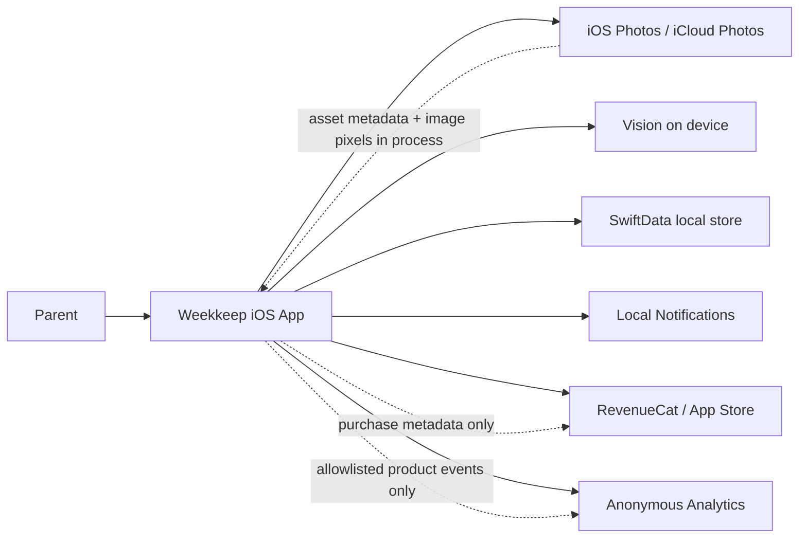
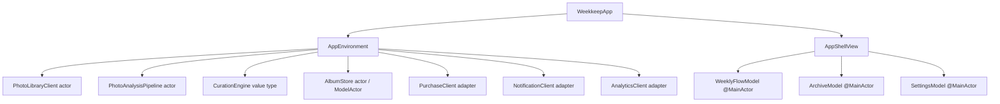
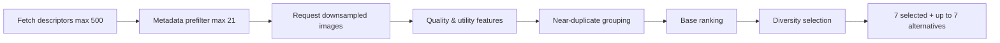

# Weekkeep Technical Requirements Document

| 항목 | 값 |
|---|---|
| 버전 | 0.6-approved |
| 기준일 | 2026-08-07 |
| 상태 | Approved |
| 대상 | Weekkeep V1 |
| 기준 제품 문서 | [PRD](01-PRD.md) |
| 기준 흐름 문서 | [Use Cases](02-USE-CASES.md), [IA](03-IA.md) |

## 1. 기술 목표

Weekkeep V1의 기술 목표는 ‘가장 많은 기능’이 아니라 다음 다섯 가지입니다.

1. Photos 권한과 iCloud 상태가 달라도 데이터 손상 없이 동작할 것
2. 최대 500개 descriptor를 저비용으로 훑고, deterministic prefilter 후 최대 21개(7일×3개)만 Vision에 보내 bounded foreground 분석을 할 것
3. 같은 주의 기록을 절대 중복 생성하지 않을 것
4. 사진 관련 데이터가 외부 SDK와 네트워크 경계를 넘지 않을 것
5. 완료된 주만 대상으로 하며 반복 주의 활성 검토를 60초 안에 끝낼 수 있을 것

## 2. 실행 가능성 결론

**V1은 현재 Apple 공개 프레임워크로 구현 가능합니다.** Photos는 권한별 자산 접근을, Vision은 미학 점수와 이미지 특징 분석을, SwiftData는 로컬 모델 저장을, UserNotifications는 로컬 리마인더를 제공합니다. RevenueCat은 Shipaton에 필요한 실제 구매와 복원을 처리합니다.

가장 큰 기술적 불확실성은 ‘분석할 수 있는가’가 아니라 **자동 선택 7장이 부모의 의미와 얼마나 자주 일치하는가**입니다. 따라서 큐레이션 엔진은 교체 가능한 초안을 만드는 보조 도구로 정의하며, 신원 식별이나 완벽한 추억 판단을 약속하지 않습니다.

### 의도적으로 하지 않는 것

- iOS가 보장하지 않는 시점에 background에서 사진 분석을 완료했다고 가정하지 않습니다.
- 알림 문구로 ‘앨범이 이미 준비됐다’고 거짓 약속하지 않습니다.
- PHAsset 또는 Vision observation을 UI와 actor 경계 전체로 전달하지 않습니다.
- 기존 Peeka Xcode 프로젝트를 복제하지 않습니다.

## 3. 플랫폼과 도구

| 항목 | 기술 계약 | Decision |
|---|---|---|
| 언어 | Swift 6, strict concurrency | `D-016` |
| UI | SwiftUI + Observation | `D-016` |
| 최소 OS | iOS 18.0 | `D-003` |
| 기기 | iPhone only in V1 | `D-003` |
| persistence | SwiftData, local-only configuration | `D-007` |
| photos | PhotoKit / PhotosUI | — |
| analysis | Vision aesthetics/feature print + bounded local fallback heuristic | `D-017` |
| purchases | RevenueCat Purchases SDK | Shipaton `BR-002` |
| notifications | UserNotifications local notification | `D-009` |
| analytics | PostHog EU Cloud, anonymous explicit allowlist only | `D-018`, `D-019` |
| dependency manager | Swift Package Manager | — |
| project generation | XcodeGen 2.46.0, `project.yml` SSOT | `D-020` |
| CI | GitHub Actions macOS runner + `xcodebuild` | — |

Xcode와 앱 SDK의 정확한 patch version은 구현 시작 시 고정합니다. XcodeGen은 `2.46.0`으로 먼저 고정합니다. 배포 대상 iOS 18.0은 Vision 미학 점수 API 사용과 범위 축소를 위한 제품 결정입니다.

## 4. Architecture Decision Records

ADR은 승인 상태를 소유하지 않습니다. 결정값과 현재 상태는 [Decision Registry](00-INDEX.md#5-decision-registry--결정값과-상태의-ssot)에서만 관리하고, 여기에는 기술적 결과만 기록합니다.

| ID | Decision | 기술적 결과 |
|---|---|---|
| `ADR-001` | `D-002`, `D-011` | Peeka의 기능 단위 아이디어만 계약·fixture를 거쳐 참고 |
| `ADR-002` | `D-003` | 최신 Vision 사용, 구형 OS fallback 제외 |
| `ADR-003` | `D-016` | 작은 feature model, Observation, Swift 6 strict concurrency |
| `ADR-004` | `D-007`, `D-022` | backend/CloudKit 제거, 현재 설치 안의 migration만 책임 |
| `ADR-005` | `D-017` | background 완료 약속 제거, 취소 가능한 foreground task |
| `ADR-006` | `D-004`, `D-005` | 분석 속도와 교체 UX에 7+7 상한 적용 |
| `ADR-007` | `D-018` | RevenueCat/PostHog/notification 교체와 test 가능 |
| `ADR-008` | `D-009`, `D-025` | 서버·NSE·App Group 없이 반복 루프 구현 |
| `ADR-009` | `D-019` | EU host·anonymous-only·deny-by-default adapter를 사용하고 SDK 자동 수집 surface 전체 비활성 |
| `ADR-010` | `D-020` | XcodeGen 2.46.0과 `project.yml`을 고정하고 generated `.xcodeproj`를 git에서 제외; local·CI가 동일 명령으로 생성 |
| `ADR-011` | `D-021`, `D-022` | 저장 용량과 사진 중복을 줄이는 대신 Photos 삭제·앱 삭제·기기 변경에 영향 받음 |
| `ADR-012` | `D-024`, `D-026`–`D-029` | App Screens V2를 Light-only SwiftUI token/component로 구현하고 review gesture를 명시적 state로 모델링 |
| `ADR-013` | `D-032` | metadata scan과 Vision work를 분리하고 local-day/time-bucket coverage, 21 cap, fast thumbnail, per-asset/global budget을 pipeline contract로 고정 |
| `ADR-014` | `D-033` | replacement 후보를 same-day first로 분리하고 명시적 other-day opt-in과 selected-day alternative retention을 domain/UI adapter에 반영 |
| `ADR-015` | `D-034` | saved PhotoKit images를 on-device renderer로 Story/Post temporary artifact로 만들고 native share sheet에만 전달; social/cloud/server 경계는 추가하지 않음 |
| `ADR-016` | `D-035` | approved fixture image resource를 소비하는 focused `FixturePhotoStory` SwiftUI component가 onboarding vertical binding과 Ready/Plus compact rail variant의 geometry를 공유한다. Plus routing은 기존 `WeeklySheet.paywall` item을 `fullScreenCover(item:)`로 표시하고 notification/replacement sheet state와 같은 enum을 필터링해 별도 boolean modal state를 만들지 않는다. web/OG는 같은 fixture source와 flat geometry를 deterministic tooling으로 소비한다 |
| `ADR-017` | `D-036` | `WeekRangeCalculator`가 completed local ISO week와 rolling fallback 후보를 순서대로 제시하고 eligible descriptor count로 단일 선택을 확정한다. 선택된 `WeekRange`는 `WeeklyFlowModel.resolvedCurationRange`로 root resolution부터 curation까지 pin하며, strategy는 기존 저장 schema를 깨지 않도록 Welcome key namespace에서 파생한다. completed Welcome은 `weekEnd`, fallback/legacy rolling은 저장 시점 다음 월요일을 cycle로 사용하고 persisted cycle을 보존한다. `preRegularWaiting`은 최신 snapshot을 availability와 함께 읽어 실제 cover/placeholder·exact date·archive/share action을 제공하고 header rail을 중복 렌더링하지 않는다 |

## 5. 시스템 컨텍스트



### 신뢰 경계

| 경계 | 통과 가능 | 통과 금지 |
|---|---|---|
| Photos → app process | 허용된 자산 metadata, 분석용 downsampled pixels | 권한 밖 자산 |
| app → SwiftData | localIdentifier, 주차, 순서, 로컬 score snapshot | 원본 이미지 binary |
| app → RevenueCat | anonymous customer ID, product, transaction/entitlement | 사진 정보, weekKey |
| app → Analytics | allowlisted event, bucketed count/duration | 사진 ID/파일/픽셀/위치/촬영시각/weekKey |
| app → notification center | 일반 reminder copy, app deep link | 가족 이름, 사진 preview, 민감한 내용 |

## 6. 코드 구조

```text
weekkeep/
├── project.yml
├── Config/
│   ├── Base.xcconfig
│   ├── Debug.xcconfig
│   └── Release.xcconfig
├── Weekkeep/
│   ├── App/
│   │   ├── WeekkeepApp.swift
│   │   ├── AppEnvironment.swift
│   │   ├── AppTab.swift
│   │   └── AppRouter.swift
│   ├── Features/
│   │   ├── Onboarding/
│   │   ├── WeeklyCuration/
│   │   ├── Archive/
│   │   ├── Settings/
│   │   └── Paywall/
│   ├── Domain/
│   │   ├── Models/
│   │   ├── Policies/
│   │   └── Errors/
│   ├── Data/
│   │   ├── Persistence/
│   │   ├── Photos/
│   │   └── Curation/
│   ├── Integrations/
│   │   ├── Purchases/
│   │   ├── Analytics/
│   │   └── Notifications/
│   ├── DesignSystem/
│   │   ├── Theme/
│   │   │   ├── WeekkeepColors.swift
│   │   │   └── WeekkeepTypography.swift
│   │   └── Components/
│   │       ├── SevenStitchRail.swift
│   │       ├── WeekkeepTabIcon.swift
│   │       └── WeeklyPhotoGrid.swift
│   └── Resources/
├── WeekkeepTests/
├── WeekkeepUITests/
└── docs/
```

### 구조 규칙

- View는 렌더링과 user intent 전달만 담당합니다.
- 화면별 `@MainActor @Observable` model을 사용하고 app 전체 giant ViewModel을 만들지 않습니다.
- 상태 없는 정책과 scoring은 Foundation-only target으로 분리해 빠르게 test합니다.
- 외부 SDK import는 `Integrations` 하위 adapter에서만 허용합니다.
- feature가 다른 feature의 concrete model을 직접 참조하지 않고 domain contract를 사용합니다.
- reusable view는 실제 두 곳 이상에서 사용되거나 design token을 강제할 때만 DesignSystem으로 올립니다.

### V2 디자인 구현 계약

- app target의 appearance를 Light로 고정하고 semantic color resolver에 Dark variant를 만들지 않습니다.
- `LINESeedKR-Rg.ttf`와 `LINESeedKR-Bd.ttf`를 bundle resource 및 `UIAppFonts`에 등록하고 PostScript name smoke test를 둡니다.
- `design/brand/weekkeep-wordmark.png`는 `Assets.xcassets` image set으로 byte-preserving bundle하고 `WeekkeepWordmark`가 exact image resource를 렌더링합니다. Text approximation, tint, AppIcon substitution은 허용하지 않습니다.
- `SevenStitchRail`은 public input과 무관하게 `stitchCount == 7`을 유지하며 progress는 `0...7`로 clamp합니다. 모든 slot은 index별 D-030 muted rainbow를 유지하고 filled/unfilled, selected, progress, muted state는 opacity와 기존 geometry로 구분합니다. TabView는 `ThisWeekTabIcon`, `WeeksTabIcon`, `SettingsTabIcon`의 세 original-rendering vector asset을 사용하고, 각 asset은 고유한 Plum semantic silhouette만 가지며 bottom tab bar에는 decorative rainbow stitch를 렌더링하지 않습니다.
- onboarding/Ready/Plus explanatory preview는 `design/fixtures/app-store-family-moments/01...07` PNG를 seven named image sets로 bundle하고, 하나의 `FixturePhotoStory` component 안에서 onboarding vertical binding 또는 compact exact-seven rail과 hero+2+4 geometry를 공유합니다. faux-content bar, overlapping card-stack fallback, gradient/SF Symbol fake-photo art는 포함하지 않습니다. 이 이미지는 정적 product preview일 뿐 Photos user content나 analytics/vendor payload가 아닙니다.
- Weekly Review는 기존 header/date rows를 하나의 compact semantic header cluster로 구성하고, 7-photo grid는 semantic photo order와 visual placement를 분리해 full-width 16:10 hero+2+4를 8pt token gap으로 렌더링합니다. 44pt target·지원 폭 조건을 만족하지 못하면 하단 adaptive layout을 2-column으로 선택합니다.
- Onboarding, This Week, Weekly Review, Archive, Plus, share, and custom Settings roots use the shared `WeekkeepScreenLayout` contract: 20pt horizontal content edges above 375pt and 16pt at or below 375pt. Weekly Review keeps its local hierarchy explicit through `WeeklyReviewSpacing` (32pt header→editorial, 12pt title/body, 32pt editorial/body→media, 8pt photo gutter, 16pt helper/privacy, 24pt primary action); share preparation keeps picker/control internals native and uses a 24pt picker→content boundary through `WeeklyAlbumShareSpacing`.
- review의 save action은 safe-area inset이나 overlay dock이 아니라 complete grid와 helper/replacement action, PrivacyBadge 뒤의 normal scroll content에 배치합니다. PrivacyBadge는 tinted container 없이 기기 내 처리 범위를 설명하는 factual inline note이며, SevenStitchRail은 일곱 개의 독립 stitch와 추가 선 없는 geometry로 렌더링합니다.
- `ThisWeekView`의 `welcomePending`/`ready` start action은 `ReadyStateView` 안에서 제목·본문 다음, explanatory photo story 전에 normal document flow로 렌더링합니다. `WeekkeepTabHostSpacing.bottomScrollClearance`는 CTA와 무관한 실제 scroll runway로, photo story/count/limited notice/PrivacyBadge가 native floating tab bar 위에서 끝까지 settle하도록 합니다. safe-area footer, overlay dock, pinned naming은 사용하지 않으며 다른 root state와 route surface에는 CTA를 추가하지 않습니다.
- iOS 26의 hosted tab route가 ScrollView content를 status region 아래로 underlap할 수 있으므로 RootView는 pure `WeekkeepSystemSafeAreaResolver`를 runtime-first로 호출하고, runtime 값이 모두 0일 때만 active scene/RootView portrait geometry fallback을 사용해 `WeekkeepSystemSafeArea` environment boundary를 주입합니다. `WeeklyReviewView`는 이 boundary와 local proxy safe-area만 소비해 동일한 Cream surface를 unsafe 영역까지 offset한 non-interactive occluder로 사용합니다. visible inset bar/divider/dock은 추가하지 않으며, 72pt real scroll runway가 lower-action state를 editorial whole-or-occluded boundary와 함께 안정시키도록 합니다.
- review의 `selectedIndex: Int?`와 modal destination은 서로 독립된 명시적 state입니다. 첫 photo intent는 선택, 같은 선택 photo의 다음 intent는 viewer, replace intent는 그 index의 sheet로 reducer가 결정합니다.
- VoiceOver의 `크게 보기`·`사진 교체` custom action은 tap count에 의존하지 않고 index를 destination에 직접 전달합니다.
- replacement는 draft의 selected set에서 한 element만 교체하고 review presentation index를 유지합니다. persistence upsert 직전에 최종 set을 촬영 시간순으로 정규화하고 cover metadata를 별도로 저장합니다.
- replacement는 crossfade + light selection haptic을 사용합니다. save confirmation은 최종 사진을 60–80ms 간격으로 순차 reveal하며 약 1초 안에 끝납니다. Reduce Motion에서는 둘 다 짧은 opacity transition으로 대체합니다.

## 7. 런타임 구성



### AppEnvironment

`AppEnvironment`는 production dependency를 한 번 조립해 SwiftUI environment로 주입합니다. Preview/test는 각 protocol의 in-memory fake를 주입합니다. vendor SDK가 singleton을 요구해도 feature 코드는 singleton을 직접 호출하지 않습니다.

### Navigation

- `AppTab` enum: `.week`, `.archive`, `.settings`
- 탭별 route enum과 `NavigationPath` 사용
- modal state는 enum item으로 표현해 sheet boolean 충돌을 피함
- deep link는 `AppRouter`가 parse하고 권한/온보딩 gate 후 route 실행

## 8. Domain Model

### SwiftData schema v1

#### `WeeklyAlbum`

| 필드 | 타입 | 규칙 |
|---|---|---|
| `id` | UUID | local stable ID |
| `weekKey` | String | unique, regular는 `YYYY-Www`, Welcome은 `welcome-completed-*`/`welcome-rolling-*`/legacy `welcome-*` namespace |
| `kindRaw` | String | `welcome` / `regular` |
| `weekStart` | Date | 절대 시각 저장 |
| `weekEnd` | Date | nominal range end |
| `analysisCutoff` | Date | 실제 사진 수집 종료 시각 |
| `createdAt` | Date | 최초 저장 |
| `updatedAt` | Date | 마지막 upsert |
| `coverPhotoID` | UUID? | AlbumPhoto local ID, 없으면 first available |
| `photos` | [AlbumPhoto] | cascade relationship |

#### `AlbumPhoto`

| 필드 | 타입 | 규칙 |
|---|---|---|
| `id` | UUID | local stable ID |
| `assetLocalIdentifier` | String | local-only, analytics/log 금지 |
| `capturedAt` | Date? | display/order용 local metadata |
| `position` | Int | 0-based, album 안에서 unique 검증 |
| `sourceRaw` | String | `initial` / `replacement` |
| `scoreSnapshot` | Double? | 디버그/quality 실험용 local only, release 저장 여부 gate |
| `album` | WeeklyAlbum? | inverse relationship |

### 저장 제약

- DB unique constraint: `WeeklyAlbum.weekKey`
- domain validation: 한 album당 photo 1–7개, 중복 `assetLocalIdentifier` 없음, position 연속
- `createdAt`은 update에서 유지
- 관계 교체와 album update를 한 `ModelContext` save로 수행
- 저장 실패 시 context rollback 후 draft 유지
- 무료 사용 수는 별도 counter가 아니라 저장된 album count에서 파생

### UserDefaults 설정

| key | 값 |
|---|---|
| `onboardingCompleted` | Bool |
| `regularCycleStartsAt` | Date? |
| `notificationPrimerShown` | Bool |
| `preferredReminderWeekday` | V1은 Monday 고정, 향후 대비 값 선택적 |
| `preferredReminderHour/minute` | V1은 20:30 고정, 향후 대비 값 선택적 |
| `lastSeenAppVersion` | String |

Plus entitlement를 UserDefaults boolean으로 신뢰하지 않습니다. RevenueCat `CustomerInfo`와 캐시된 entitlement contract를 사용합니다.

### CurationDraft

저장 전 draft는 `Sendable` value type으로 메모리에 둡니다.

```swift
struct CurationDraft: Sendable, Equatable {
    let id: UUID
    let kind: AlbumKind
    let week: WeekRange
    let analysisCutoff: Date
    var selected: [PhotoReference]
    var alternatives: [PhotoReference]
    var replacementCount: Int
    var skippedAssetCount: Int
}
```

앱이 강제 종료되면 draft 복원을 약속하지 않고 같은 범위로 재분석합니다. 저장 실패로 화면에 머무는 동안에는 draft를 유지합니다.

Review presentation state는 저장 domain model에 넣지 않고 feature state로 유지합니다.

```swift
enum ReviewDestination: Equatable {
    case viewer(index: Int)
    case replacement(index: Int)
}

struct ReviewPresentationState: Equatable {
    var selectedIndex: Int?
    var destination: ReviewDestination?
}
```

## 9. Week 계산

### `WeekRangeCalculator`

입력:

- `now: Date`
- `calendar: Calendar` (`firstWeekday = 2`, locale-independent)
- `timeZone: TimeZone`
- onboarding/cycle state

출력:

```swift
struct WeekRange: Sendable, Equatable {
    let key: String
    let start: Date
    let end: Date
    let cutoff: Date
    let eligibleFrom: Date?
    let eligibleUntil: Date?
    let kind: AlbumKind
}
```

Regular Week의 내부 날짜 범위는 `[start, end)` 반개구간으로 표현합니다. `start`는 월요일 00:00, `end`는 다음 월요일 00:00이며 UI에서는 마지막 포함일을 일요일로 표시합니다. `eligibleUntil`도 exclusive입니다. Welcome Week는 이 regular gate를 거치지 않으므로 두 eligibility 값이 `nil`입니다.

첫 앨범 resolution은 다음 순수 계약을 따릅니다.

- `preferredFirstAlbumRange(now:)`: 현재 local ISO week의 직전 월요일–일요일 완료 주를 반환합니다.
- preferred 범위의 eligible count가 0일 때만 `rollingFirstAlbumRange(analysisStartedAt:)`를 조회합니다.
- `selectFirstAlbumRange`는 preferred count > 0이면 completed strategy를, preferred가 0이고 fallback > 0이면 rolling fallback strategy를 선택하며 둘 다 0이면 `nil`입니다.
- strategy는 `WeekRange`의 Welcome key prefix로 파생하므로 SwiftData schema migration이 없습니다. 기존 `welcome-*`는 `legacyRollingWelcome`으로 해석합니다.
- `WeeklyFlowModel`은 root resolution에서 선택한 exact range를 `resolvedCurationRange`에 보관하고 CTA·권한 resume·paywall resume에서 현재 시각으로 다시 계산하지 않습니다.

### `WeekRootStateReducer`

[IA의 우선순위 계약](03-IA.md#weekrootstatereducer-계약)을 순수 함수로 구현합니다. feature view나 비동기 callback이 여러 boolean을 조합해 root 상태를 직접 만들 수 없습니다.

```swift
struct WeekRootSnapshot: Sendable, Equatable {
    let permission: LoadState<PhotoPermissionState>
    let localState: LoadState<LocalWeekState>
    let eligiblePhotoCount: LoadState<Int>?
    let creationAccess: LoadState<CreationAccess>?
}

enum WeekRootState: Sendable, Equatable {
    case loading(WeekRootResolutionStage)
    case permissionBlocked(PhotoPermissionIssue)
    case recoverableError(WeekRootResolutionError)
    case welcomePending(PhotoAccessScope)
    case preRegularWaiting
    case saved(UUID)
    case noEligiblePhotos(PhotoAccessScope)
    case entitlementLocked
    case ready(PhotoAccessScope, photoCount: Int)
}
```

- reducer는 IA에 적힌 위→아래 순서대로 평가하고 정확히 한 case만 반환합니다.
- 각 dependency는 permission → localState → photos → entitlement 순서로 필요한 시점에만 해석합니다. 뒤 단계가 loading이어도 앞 단계에서 확정 가능한 blocker/waiting/saved 상태를 지연시키지 않습니다.
- target과 saved lookup을 먼저 고정한 뒤 photo count와 entitlement를 평가합니다.
- `eligiblePhotoCount == 0`은 `entitlementLocked`보다 우선합니다.
- `creationAccess == unresolved`이면 `inactive`로 변환하지 않고 `loading` 또는 `recoverableError`를 유지합니다.
- state transition의 side effect는 `WeeklyFlowModel`이 명시적 user action에서만 실행합니다.

### 규칙

1. 내부 연산은 injected Calendar/TimeZone을 사용하고 `Calendar.current`를 여러 곳에서 직접 읽지 않습니다.
2. regular `weekKey` 생성은 week-based year와 week-of-year를 함께 사용합니다.
3. completed-calendar-week Welcome 저장 시 `regularCycleStartsAt = album.weekEnd`로 고정합니다. rolling fallback과 legacy rolling Welcome은 저장 시점 다음 월요일을 사용하고, 이미 persisted 값이 있으면 덮어쓰지 않습니다. Regular target 후보는 반드시 `start >= regularCycleStartsAt`이어야 하며, 그 전 주를 Welcome 직후 다시 만들지 않습니다.
4. Regular target은 현재 시각보다 먼저 완전히 끝난 가장 최근 월요일–월요일 반개구간 하나입니다. 진행 중인 주는 대상이 아닙니다.
5. `eligibleFrom`은 대상 주의 `end`, `eligibleUntil`은 calendar로 7일을 더한 다음 월요일 00:00입니다. `eligibleFrom <= now < eligibleUntil`이면 언제든 시작할 수 있습니다.
6. 월요일 20:30 알림은 진입점일 뿐 eligibility를 열거나 닫지 않습니다.
7. Regular Week의 `cutoff`는 완료된 주의 `end`로 고정합니다. completed Welcome도 `end`를 cutoff로 사용하고 rolling/legacy Welcome만 분석 시작 시각을 cutoff로 사용합니다.
8. 완료 창을 놓쳐 다음 주가 끝나면 이전 미저장 범위를 queue에 쌓지 않고 최신 완료 주로 대체합니다.
9. eligibility 안에서 `CurationDraft`를 만들면 그 `weekKey`를 flow lifetime 동안 pin합니다. 자정이나 significant time change가 와도 저장·취소 전에는 target을 교체하지 않습니다.
10. DST로 하루가 23/25시간이어도 calendar date interval을 사용하고 초 단위 `7*24h` 계산을 하지 않습니다.
11. 저장된 key 충돌 시 새 insert가 아니라 기존 범위를 유지한 update입니다.

필수 fixture:

- 연말/연초 ISO week
- 윤년 2월
- DST 시작/종료 지역
- 서울 ↔ 미국 시간대 변경
- 일요일 23:59, 월요일 00:00/20:30, 다음 일요일 23:59, 다음 월요일 00:00
- 일요일 23:59 시작 → 월요일 00:00 이후 저장하는 in-flight pinned draft
- Welcome 저장 요일별 다음 월요일 source start와 첫 non-overlapping Regular eligibility

## 10. Photo Library 접근

### `PhotoLibraryClient` contract

```swift
protocol PhotoLibraryClient: Sendable {
    func authorizationStatus() async -> PhotoAuthorization
    func requestAuthorization() async -> PhotoAuthorization
    func fetchDescriptors(in range: DateInterval, limit: Int) async throws -> [PhotoDescriptor]
    func analysisImage(for id: PhotoID, targetSize: CGSize) async throws -> AnalysisImage
    func displayImage(for id: PhotoID, targetSize: CGSize) async throws -> DisplayImageResult
    func assetAvailability(for ids: [PhotoID]) async -> Set<PhotoID>
}
```

실제 구현 세부 타입은 Photos framework 안에 격리합니다. Domain/UI에는 `PHAsset`을 노출하지 않습니다.

### Fetch 규칙

- mediaType image
- creationDate가 고정 range 안에 있는 자산
- hidden 제외
- screenshot subtype 제외
- creationDate 오름차순 fetch 결과가 500개 이하면 모두 전달하고, 500개를 넘으면 첫 500개에 치우치지 않도록 전체 chronological index range에서 최대 500개를 균등 추출한 뒤 sampling 단계에 전달
- limited 권한에서는 접근 가능한 결과만 사용
- 접근 자산 수를 analytics에 보낼 때는 bucket(`0`, `1-6`, `7-14`, `15-30`, `31-50`, `51-100`, `100+`)만 사용

### Metadata prefilter와 21개 Vision cap

1. PhotoKit descriptor fetch는 요청된 날짜 범위와 permission scope 안에서 최대 500개까지 수행합니다.
2. eligible descriptor를 사용자의 display timezone 기준 local calendar day로 묶고, 각 day 안을 4시간 time bucket으로 나눕니다.
3. day와 time bucket coverage를 먼저 round-robin으로 확보합니다. 같은 bucket 안에서만 favorite와 pixel area를 약한 tie-breaker로 사용하고, 마지막은 capturedAt와 local ID의 stable order로 결정합니다.
4. `weekKey` seed는 day queue 시작 offset에만 사용합니다. 같은 week/input은 같은 결과를 내며, input 순서가 달라도 stable chronological output을 냅니다.
5. 이 prefilter 결과는 최대 21개입니다. 100 eligible descriptors를 넣어도 Vision request는 21개를 넘지 않습니다. 7일 각각에서 최대 3개씩 확보해 선택 7장, same-day 교체 후보, 품질 여유를 함께 유지합니다.

`MetadataCandidatePrefilter.descriptorScanLimit == 500`과 `maximumVisionCandidates == 21`을 source/test contract로 고정합니다. 이 문서의 21 cap은 Vision work의 설계 상한이며 실기기 처리 시간을 측정했다는 뜻이 아닙니다.

### iCloud Photos

- analysis용 이미지는 384–448px 범위의 fast PhotoKit representation(현재 target 416px)으로 `networkAccessAllowed`를 켜 요청합니다.
- display/share 요청은 별도의 opportunistic high-quality path를 유지하며 analysis thumbnail 최적화가 사용자-facing image quality를 바꾸지 않습니다.
- 요청 ID를 추적해 task cancel 시 Photos request도 취소하고, analysis의 첫 fast representation을 채택한 뒤 남은 PhotoKit delivery도 즉시 취소해 불필요한 후속 작업을 남기지 않습니다.
- `PhotoLibraryClient`는 PhotoKit callback을 노출하지 않는 좁은 adapter로 유지합니다. 분석 orchestration의 `PhotoRequestProgressAggregator`가 각 candidate의 `analysisImage` 요청이 성공·실패·timeout·utility skip 중 하나로 해소될 때 1개 request를 완료로 집계해 UI에 전달합니다. 따라서 이 값은 iCloud byte/download progress가 아니라 `resolved photo requests / total sampled requests`인 truthful aggregate progress이며, asset ID와 vendor payload는 포함하지 않습니다.
- aggregator는 `[0, 1]` 안에서 단조 증가하고, 새 분석 시작 시 reset되며, 취소 시 0/0으로 정리됩니다. 남은 작업의 명시적 skip/timeout도 orchestration에서 완료로 해소한 뒤 partial draft를 만들므로 가짜 소수점 정밀도를 주장하지 않습니다.
- Wi-Fi만 강제하지 않습니다. 사용자가 취소할 수 있어야 합니다.

## 11. On-device Analysis Pipeline



### Bounded foreground analysis

- pipeline은 foreground actor에서만 실행되고 caller cancellation이 fetch, PhotoKit request, Vision task, ranking까지 전파됩니다.
- 각 candidate는 per-asset timeout(현재 1.5초 design target)을 가집니다. slow/iCloud asset 하나가 전체 주를 붙잡지 않습니다.
- per-asset wait은 약 1.5초, global foreground budget은 약 12초 design target입니다. deadline에 도달하면 남은 sampled candidates를 skipped로 표시하고 실제 성공 candidates로 partial draft를 만들며, 모두 실패하면 기존 recoverable error를 사용합니다.
- progress는 `overallCompleted/overallTotal`로 prefilter부터 skipped work까지 단조 증가합니다. 현재 구현의 aggregate 단위는 `resolved photo requests / total sampled requests`이며, Vision 완료 수·iCloud byte 수·다운로드 속도를 의미한다고 과장하지 않습니다.

### 단계별 책임

#### A. Utility filtering

- PhotoKit screenshot subtype hard exclude
- Vision aesthetics observation의 utility 판단이 제공되면 보조 exclude
- 지나치게 작은 이미지, decode 불가 이미지 제외
- 문서/OCR 감지는 V1 필수가 아니며 false positive가 높으면 추가하지 않음

#### B. Quality feature extraction

- Vision image aesthetics overall score
- `CalculateImageAestheticsScoresRequest`의 iOS 18 overall score를 `[-1, 1] → [0, 1]`로 정규화하고, 일시적인 Vision model/context 오류에는 `VNCalculateImageAestheticsScoresRequest`와 bounded neutral prior를 순서대로 사용
- face rectangle count에서 얻는 bounded composition prior는 **사진 품질 보조**로만 사용하며 사람을 식별하지 않음
- 32×32 downsampled contrast heuristic; descriptor resolution fitness is applied in ranking
- favorite는 매우 작은 positive prior
- 위치, 연락처, 사람 이름은 사용하지 않음

#### C. Near-duplicate grouping

- Vision image feature print 거리로 시각 유사도 계산
- feature print 비교 상태는 현재 weekly shortlist 안에서만 유지하고 매 분석 세션 시작 시 초기화해 과거 주와 비교하거나 비용이 누적되지 않게 함
- threshold는 fixture dataset으로 보정하고 remote에서 임의 변경하지 않음
- 이미 선택된 유사 그룹에는 diversity penalty를 주며, 남은 후보는 같은 날짜 교체용 alternative가 될 수 있음

#### D. Diversity-aware selection

초기 base score 가설:

```text
baseQuality =
  0.50 * aesthetics
  + 0.20 * faceCompositionQuality(if face exists; neutral otherwise)
  + 0.15 * technicalUsability
  + 0.10 * resolutionFitness
  + 0.05 * favoritePrior
```

7장 선택은 base 순위만 자르지 않고 greedy objective를 사용합니다.

```text
selectionValue(candidate) =
  baseQuality
  + dayCoverageBonus
  + timeOfDayCoverageBonus
  + visualNoveltyBonus
  - nearDuplicatePenalty
  - sameMomentConcentrationPenalty
```

가중치는 V1 코드 상수와 test fixture로 관리하고, 베타 데이터에서는 사진 ID가 아니라 교체 index/count만 측정합니다.

### 중요한 금지사항

- 얼굴 embedding으로 특정 아이를 enrollment/식별하지 않음
- 얼굴이 없는 사진을 자동으로 낮은 가치로 단정하지 않음
- 피부색, 성별, 연령, 감정, 가족 관계 추론 금지
- `best photos` 같은 절대적 표현 금지

### 결과 계약

- selected: `min(validCount, 7)`
- alternatives: `min(max(validCount - selectedCount, 0), 7)`
- selected 내부 중복 asset ID 없음
- selected와 alternatives 교집합 없음
- 모든 결과가 요청 range 안에 있음
- UI 표시 순서는 capturedAt 오름차순
- cover는 selected 중 별도 quality top이지만 album photo order를 바꾸지 않음

- alternatives는 가능한 경우 selected local calendar day마다 미사용 candidate를 하나 이상 우선 보존하고, 나머지는 stable score order로 최대 7개까지 채움
- `replacementCandidates`의 default query는 display timezone same-day only이며, other-day candidates는 explicit opt-in state 이후에만 반환

## 11.5 Local weekly album share

- `WeeklyAlbumShareRenderer`는 `WeeklyAlbumSnapshot`과 PhotoKit `displayImage` value data를 받아 `UIImage`/Core Graphics로만 렌더링합니다. `PHAsset`은 renderer 경계를 넘지 않습니다.
- Story는 정확히 1080×1920, Post는 정확히 1080×1350 canvas입니다. 7장은 hero+2+4 frame table, 1–6장은 실제 image count에 맞춘 adaptive frame table을 사용합니다.
- canvas는 semantic Weekkeep palette로 warm paper, canonical wordmark, local date range, optional cumulative serial label, exact seven muted stitches 위의 localized conversational prompt, `Made with Weekkeep`를 그립니다. serial ordinal은 `AlbumStore.listAlbums()`의 `createdAt` → `weekStart` → UUID 문자열 deterministic sort에서 1-based로 파생하며 SwiftData에 저장하지 않습니다. filename, location, Photos identifier, score, analytics data, child/family identity와 fake image는 draw input이 아닙니다.
- renderer output은 temporary `WeekkeepShare` directory의 atomic file 1개에만 쓰고, 새 준비 시 강제 종료 등으로 남은 이전 artifact를 먼저 정리합니다. explicit share button 뒤 `UIActivityViewController`에 image `UIActivityItemSource`를 첫 항목으로 전달해 localized generic title과 이미 렌더링한 artifact thumbnail을 native preview로 제공하며, 실제 image item은 local file URL입니다. 별도의 native item sources로 localized parent invitation과 canonical URL `https://apps.apple.com/app/id6798449478`을 전달합니다. UIActivityViewController의 destination 협상에 따라 image-only destination은 image를 유지하고 link-capable destination은 text와 URL을 사용할 수 있습니다. private activity identifier나 destination별 분기를 사용하지 않습니다.
- V1 artifact에는 public install URL, QR code, loud ad overlay를 그리지 않으며 existing `Made with Weekkeep` branding을 유지합니다. recipient/destination/photo metadata는 수집하지 않습니다. 이 share contract는 historical ASC build 6에는 포함되지 않았고, 현재 제출된 ASC build 7에 반영되었으며 URL이 공개 릴리스 전에 live라고 주장하지 않습니다. local share는 backup/import/export of app state가 아니라 user-triggered presentation artifact입니다.
- Photos availability가 줄면 renderer는 실제 available images만으로 adaptive layout을 만들고, 모두 없으면 share preparation을 실패 상태로 표시합니다.

## 12. Concurrency와 메모리

### 격리 전략

- `WeeklyFlowModel`: `@MainActor`
- `PhotoLibraryService`: actor 또는 serial isolation
- `PhotoAnalysisPipeline`: actor
- `AlbumStore`: `@ModelActor` 또는 전용 actor
- 순수 `CurationEngine`: immutable `Sendable` input/output
- RevenueCat/PostHog callback은 adapter에서 async API로 변환 후 MainActor UI 갱신

### 규칙

- `PHAsset`과 non-Sendable image 객체를 actor 밖으로 장기 전달하지 않습니다.
- actor 경계에는 `PhotoID`, metadata value type, 필요한 경우 안전한 pixel buffer wrapper만 전달합니다.
- V1 candidate 분석은 예측 가능한 thermal/memory와 진행률을 위해 순차 실행합니다. 향후 동시성을 도입하더라도 실기기 측정과 Decision 변경 후 2–3개 이하로 제한합니다.
- 한 번에 모든 full-resolution 이미지를 메모리에 올리지 않습니다.
- 각 자산 분석 뒤 autorelease scope와 cache eviction을 고려합니다.
- 취소는 fetch → image request → Vision task → ranking까지 cooperative하게 전파합니다.

### 성능 instrumentation

`os_signpost` 구간:

- `photo_fetch`
- `icloud_fetch`
- `vision_analysis`
- `deduplication`
- `diversity_selection`
- `album_save`

로그는 count bucket, duration, error kind만 포함합니다.

## 13. Persistence와 데이터 무결성

### `AlbumStore` contract

```swift
protocol AlbumStore: Sendable {
    func album(for weekKey: String) async throws -> WeeklyAlbumSnapshot?
    func listAlbums() async throws -> [WeeklyAlbumSummary]
    func upsert(_ draft: CurationDraft) async throws -> WeeklyAlbumSnapshot
    func savedAlbumCount() async throws -> Int
}
```

### Upsert algorithm

1. draft invariant validate
2. `weekKey` fetch
3. insert 또는 existing 관계 replacement
4. cover photo validate
5. single context save
6. 다시 fetch하여 unique/invariant 확인
7. snapshot 반환

save가 실패하면 analytics 성공 이벤트와 notification primer를 실행하지 않습니다.

### Migration

- `SchemaV1`을 명시적으로 선언합니다.
- schema 변경은 lightweight여도 versioned schema와 migration plan 검토를 거칩니다.
- migration fixture store를 tests에 보관합니다.
- V1 local-only이므로 CloudKit-compatible optional relationship 제약에 맞추기 위해 모델을 왜곡하지 않습니다.

### 보존과 복원 경계

- `D-007`, `D-021`, `D-022`에 따라 V1은 CloudKit, 서버 backup, 앱 상태 export/import, 앱 관리형 restore를 구현하지 않습니다. `D-034`의 user-triggered share artifact는 이 보존 경계와 별개입니다.
- schema migration은 **같은 앱 설치 안에서 업그레이드된 store**만 지원합니다. 앱 삭제 뒤 복원이나 새 기기 이전 계약이 아닙니다.
- iOS의 기기 backup 또는 전송이 앱 데이터를 옮기는 경우가 있더라도 Weekkeep 제품 기능으로 성공을 보장하지 않습니다. 복원된 `localIdentifier`는 모두 다시 availability 검증합니다.
- 원본 사진이 Photos에 남아 있어도 저장했던 선택과 순서를 자동 추론·재생성하지 않습니다.
- `PurchaseClient.restore()`는 entitlement만 갱신하며 `AlbumStore`를 호출하지 않습니다.
- Archive와 Paywall의 개인정보·보존 안내는 `FR-022`의 한국어·영어 카피를 사용합니다. Settings는 중복 보존 요약을 렌더링하지 않고 Help & Support의 Privacy Policy action으로 연결합니다.

### 원본 누락

- list/detail 표시 때 localIdentifier availability를 batch 조회합니다.
- missing row를 DB에서 자동 삭제하지 않습니다.
- cover missing이면 첫 available 사진을 runtime fallback으로 사용하되 DB cover를 조용히 덮어쓰지 않습니다.
- 모두 missing이어도 album metadata는 남깁니다.

## 14. Purchase Integration

### `PurchaseClient` contract

```swift
protocol PurchaseClient: Sendable {
    func entitlementState() async -> EntitlementState
    func currentOffering() async throws -> PlusOffering
    func purchasePlus() async throws -> PurchaseOutcome
    func restore() async throws -> RestoreOutcome
}
```

### RevenueCat 설정

- SPM `RevenueCat` product 사용; RevenueCatUI는 custom paywall을 택하면 제외 가능
- app 시작 시 public Apple SDK key로 한 번만 configure
- 계정이 없으므로 RevenueCat anonymous app user ID 사용
- entitlement: `plus`
- offering: `default`
- App Store product: `weekkeep_plus_lifetime`
- package type: lifetime/custom non-consumable
- localized display price는 StoreProduct에서 가져옴
- Settings와 paywall에 restore 진입점

### V1 상품 구성 계약

- 제품값은 `D-008`, `D-023`에서 파생합니다. 저장된 album count가 0 또는 1이면 생성 가능하고, 2 이상이면 active Plus가 필요합니다.
- Plus는 App Store 비소모성 평생 이용권 1개이며 RevenueCat `plus` entitlement에 연결합니다.
- App Store Connect의 US 기준 가격은 $19.99로 설정하고 다른 storefront는 Apple의 자동 등가 가격을 사용합니다.
- production 앱은 숫자 가격을 상수나 localization 문자열로 보관하지 않고 `StoreProduct.localizedPriceString` 계열의 Store 제공 값만 렌더링합니다.
- KR 약 ₩29,000은 초기 storefront 예상과 StoreKit UI fixture일 뿐 entitlement 판정이나 production 표시값이 아닙니다.
- App Store product 생성, Paid Applications Agreement, RevenueCat offering/product mapping, sandbox 조회 결과는 `M4 Monetized Beta`의 외부 구성 증거로 남깁니다.

### Entitlement gate

```text
canCreateAlbum = savedAlbumCount < 2 OR entitlement.plus == active
showPaywall = targetIsUnsaved AND eligiblePhotoCount > 0 AND savedAlbumCount >= 2 AND entitlement.plus == inactive
canReadSavedAlbum = true
```

- network failure에서 Plus를 무조건 false로 덮어쓰지 않습니다.
- RevenueCat이 제공하는 cached CustomerInfo를 우선 사용하고 상태를 `active/inactive/unknown`으로 구분합니다.
- `unknown`이면 과거에 확인한 active 사용자를 즉시 잠그지 않는 정책을 보수적으로 검토합니다.
- purchase 성공은 transaction callback만이 아니라 active entitlement 확인으로 판정합니다.
- restore 성공은 paywall 안에서 먼저 acknowledged 상태로 유지하고, Continue action의 source-of-truth entitlement 재확인에서 `active`일 때만 dismiss/resume합니다. `inactive/unknown`이면 target을 unlock하지 않고 pending 상태를 유지합니다.

### 테스트

- RevenueCat Test Store로 개발 초기 smoke test
- StoreKit Configuration으로 가격/상태 UI test
- App Store sandbox에서 실제 purchase/cancel/pending/restore
- TestFlight production configuration smoke test
- restore 성공 전후 `AlbumStore` mutation 0 검증
- paywall restore acknowledged → active confirmation Continue와 inactive/unknown non-unlock 경로 검증
- 빈 새 설치에서 Plus 복원 후에도 과거 `WeeklyAlbum`을 생성하지 않으며 보존 한계 안내가 보이는지 검증

## 15. Notification Integration

### Baseline

UserNotifications의 local notification만 사용합니다. Settings는 `SettingsNotificationPresentation`이라는 순수 policy로 notification status × saved album count를 결정하며, count가 0이거나 아직 count를 확인하지 못한 경우 `.none` action을 반환합니다.

- 첫 album 저장 후 contextual primer; 저장 성공 직후 authorization status를 다시 확인해 `notDetermined`일 때만 primer를 제안하며, 이미 결정되었거나 primer를 본 상태에서는 제안하지 않음
- Settings에서 저장 기록이 0개이면 permission request와 system settings 이동을 모두 막고, status row와 설명형 static row만 렌더링
- Settings에서 저장 기록이 1개 이상이면 status row 자체가 `notDetermined`에서 request하고, `authorized`/`provisional`/`denied`/`ephemeral`에서는 system settings로 이동하며 별도 notification action row는 렌더링하지 않음
- model action은 policy가 `.none`이면 notification client의 request를 호출하지 않음; 저장 기록 count는 reminder scheduling의 전제
- primer copy: `다음 기록을 남길 때 알려드릴까요?`와 `다음 기록 가능일: {localized exact date}`
- 사용자 승인 뒤 향후 12주 월요일 20:30을 `weeklyReminder.{targetWeekKey}` 식별자의 one-off calendar trigger로 예약하며 `WeeklyReminderSchedule`이 target key를 dedupe
- 민감정보 없고 background 완료를 주장하지 않는 copy: `월요일 저녁, 여유가 될 때 다시 볼 수 있도록 알려드릴게요.`
- deep link: `weekkeep://weekly/current`
- foreground에서 authorization/status 재조회; primer accept 시에도 status를 재확인해 이미 결정된 상태에서 두 번째 system request를 만들지 않음
- foreground, 저장 성공, significant time change에서 12주 rolling schedule을 다시 계산
- 알림의 `targetWeekKey`는 직전 완료된 월–일 주이며, 알림 전 이미 저장됐다면 해당 pending request를 제거하고 다음 주 알림은 유지
- `targetWeekStart < regularCycleStartsAt`인 알림은 예약하지 않아 Welcome Week 직후 중복 기록을 유도하지 않음
- 알림을 놓쳐도 대상은 다음 일요일 23:59까지 eligible이며 별도 재촉 알림은 보내지 않음
- completed Welcome의 next eligible date는 `regularRange(startingAt: regularCycleStartsAt).eligibleFrom`으로 계산하고, notification primer와 `preRegularWaiting`이 같은 값을 사용
- 알림 delegate만 `entryPoint=notification`, 일반 initial/tab/deep-link 진입은 `entryPoint=direct`로 typed event에 전달하며 timestamp로 추론하지 않음

### 왜 background album을 만들지 않는가

iOS background task 실행 시각은 보장되지 않으며 Photos/iCloud 작업은 네트워크와 권한 상태에 좌우됩니다. V1 알림은 ‘완성된 앨범 도착’이 아니라 앱을 열어 한 주의 선택을 준비하고, 준비된 결과를 1분 안의 활성 조작으로 검토하라는 **리마인더**입니다. 사진을 살펴보는 대기 시간은 60초 활성 검토 목표에 포함하지 않습니다.

### OneSignal gate

OneSignal은 Shipaton 별도 카테고리 또는 원격 lifecycle messaging이 필요할 때만 추가합니다. 공식 iOS 설정은 Push capability, Background Mode, Notification Service Extension, App Group 등 운영 면적을 늘립니다. 다음 조건을 모두 만족하기 전에는 baseline에 넣지 않습니다.

- P0 core flow 완료
- local notification W1 데이터 확보
- 원격 메시지가 해결할 구체적 retention 문제가 있음
- 개인정보/consent와 App Store disclosure 검토 완료

## 16. Analytics Integration

### Adapter

```swift
protocol AnalyticsClient: Sendable {
    func capture(_ event: AnalyticsEvent) async
    func flush() async
}
```

`AnalyticsEvent`는 enum과 typed property로 정의합니다. 임의 `[String: Any]` 호출은 integration layer 밖에서 금지합니다.

### PostHog 승인 설정 (`D-019`)

- EU Cloud host를 사용하고 SDK anonymous distinct ID만 유지합니다.
- `personProfiles = .never`; `identify`, `alias`, `group`, user property API를 호출하지 않습니다.
- `enableSwizzling = false`, `captureApplicationLifecycleEvents = false`, `captureScreenViews = false`, `captureElementInteractions = false`, `rageClickConfig.enabled = false`.
- `sessionReplay = false`, `surveys = false`, `preloadFeatureFlags = false`, `sendFeatureFlagEvent = false`, `tracingHeaders = []`.
- `setDefaultPersonProperties = false`; 이메일, 이름, 가족 정보, 광고 ID, 위치 property를 추가하지 않습니다.
- typed `AnalyticsEvent` adapter만 `capture`를 호출할 수 있습니다. feature View와 vendor SDK 직접 호출은 build review에서 실패 처리합니다.
- `setBeforeSend`는 event-name allowlist 밖의 event를 drop하고 property allowlist 밖의 key를 제거하는 두 번째 방어선입니다.
- development/test에서는 no-op 또는 console sink

### Privacy payload audit 계획

1. `AnalyticsEvent`와 허용 property schema를 snapshot test하고 알 수 없는 event/key는 test failure로 처리합니다.
2. fake PostHog sink에서 모든 P0 흐름을 재생해 사진·자산·날짜·위치 관련 금지 key/value가 0인지 검사합니다.
3. Release-like build를 network proxy로 Welcome→분석→교체→저장→paywall까지 실행해 PostHog 요청의 event·property payload를 보관합니다.
4. PostHog live event inspector에서 명시 event 외 `$screen`, lifecycle, autocapture, rage click, replay event가 0인지 확인합니다.
5. `TST-019`와 `TST-022` 증거가 없거나 한 항목이라도 실패하면 Release에서 provider를 no-op으로 끕니다. 개인정보 제약을 완화해 통과시키지 않습니다.

### 활성 검토 시간 측정

- `WeeklyFlowModel`은 `SCR-WK-03`이 실제로 보이는 순간부터 저장 탭까지의 foreground 활성 시간만 누적합니다.
- scene이 inactive/background가 되면 timer를 멈추고 돌아오면 재개합니다.
- 분석 진행, 저장 처리, 알림에서 앱을 열기 전 시간은 제외합니다.
- 원시 초 단위 값은 외부로 보내지 않고 `under_30s`, `30_60s`, `60_120s`, `over_120s` bucket을 `EVT-album_saved.active_review_duration_bucket`으로 보냅니다.
- `EVT-album_saved.regular_sequence_bucket`은 target `weekStart`와 `regularCycleStartsAt`의 캘린더 주 차이로 `w1`, `w2`, `w3_plus`를 계산합니다. 저장 횟수나 앱 재실행 횟수로 계산하지 않으며 Welcome은 `not_applicable`입니다.
- `EVT-share_sheet_opened`는 local artifact가 준비된 뒤 native share sheet를 여는 명시적 탭에서 한 presentation당 한 번만 기록합니다. `EVT-share_completed`는 `UIActivityViewController.completionWithItemsHandler`의 `completed == true`일 때만 presentation당 한 번 기록합니다. 두 event 모두 허용 값은 `format=story|post`, `entry_point=save_confirmation|archive_detail`뿐이며 activity type, returned items, error, destination, recipient, message contents는 adapter 경계를 넘지 않습니다. 취소는 completion event를 만들지 않습니다.
- `EVT-eligible_week_opened`는 unsaved eligible regular target이 This Week root에서 열릴 때만 기록합니다. 허용 property는 `entry_point=direct|notification` 하나이며 weekKey/date/photo/identifier/recipient/destination/free-form 값은 보내지 않습니다. AppRouter notification delegate와 `onOpenURL`의 명시적 route origin을 사용하고 timestamp로 origin을 추론하지 않습니다.

### Event privacy compile-time rule

허용 property 타입:

- enum raw value
- Bool
- bucketed Int/String
- coarse duration bucket
- app version, locale, OS major

금지 property 이름/값:

- `asset`, `photo`, `filename`, `path`, `localIdentifier`
- exact `weekKey`, exact capture date/time
- location, face count per photo, Vision score per photo
- free-form error description

CI lint 또는 unit snapshot으로 event schema를 검증합니다.

## 17. Error Model

```swift
enum WeekkeepError: Error, Sendable {
    case permission(PhotoPermissionIssue)
    case noEligiblePhotos
    case photoFetch(PhotoFetchIssue)
    case analysis(AnalysisIssue)
    case persistence(PersistenceIssue)
    case purchase(PurchaseIssue)
    case notification(NotificationIssue)
}
```

### Error presentation mapping

| Domain error | 사용자 분류 | retry | 로그 수준 |
|---|---|---|---|
| denied/restricted | blocking external state | denied: Settings / restricted: policy explanation only | info |
| individual asset unavailable | partial | continue | debug/info |
| iCloud network | recoverable | retry/partial | notice |
| Vision asset failure | partial internal | automatic skip | debug aggregate |
| all analysis failed | recoverable | retry | error, sanitized |
| validation failed | internal invariant | preserve draft/support | fault |
| store save failed | recoverable/internal | retry | error |
| purchase cancelled | neutral outcome | none | info |
| purchase pending | external pending | refresh | info |

vendor error 원문은 release UI에 직접 표시하지 않습니다. 진단 로그에서도 privacy interpolation을 사용합니다.

## 18. Privacy와 Security Requirements

### Data inventory

| 데이터 | 저장 위치 | 외부 전송 | 보존 |
|---|---|---|---|
| 사진 원본/thumbnail | Photos / memory cache | 금지 | 앱이 영속 복제하지 않음 |
| Photos local identifier | SwiftData app sandbox | 금지 | album 유지 기간 |
| 촬영 시각 | SwiftData local | 금지 | album 유지 기간 |
| Vision score/feature print | memory; score snapshot 선택적 local | 금지 | feature print는 분석 종료 시 폐기 |
| 주차 메타데이터 | SwiftData local | exact 값 전송 금지 | album 유지 기간 |
| 익명 분석 ID | analytics SDK local/remote | 허용 | provider policy |
| 구매/entitlement | RevenueCat/App Store | 허용 | provider policy |

### 구현 통제

- `OSLog` 사진 ID는 `.private`로도 남기지 않는 것을 원칙으로 함
- analytics event allowlist
- URL/deep link에 사진 ID 금지
- session replay/screenshot 기능 금지
- third-party SDK privacy manifest와 required reason API 검토
- App Store Privacy Nutrition Label을 실제 event schema와 맞춤
- `NSPhotoLibraryUsageDescription` 한국어/영어 문구 검수
- SwiftData store에 iOS Data Protection 적용 여부를 release QA에서 확인
- 사용자 사진 진단 export는 release build에서 compile-out합니다. 사용자 명시적 local share artifact만 `D-034`에 따라 허용하며, debug payload나 private metadata를 추가하지 않습니다.

### 권한 목적 문자열 초안

한국어:

> 최근 완료된 월요일부터 일요일까지의 한 주에서 첫 추억을 고를 수 있도록 사진 접근을 허용해 주세요. 그 주에 적격 사진이 없으면 최근 7일을 확인할 수 있어요. 사진 고르기는 이 iPhone 안에서 이뤄져요.

영어:

> Allow Weekkeep to choose your first week from the most recently completed Monday–Sunday week. If it has no eligible photos, Weekkeep may check your most recent 7 days. Photos are processed on your iPhone.

## 19. Accessibility Engineering

- `LINESeedSansKR-Regular/Bold`를 bundle에 등록하고 `Font.custom(_:size:relativeTo:)`로 semantic Dynamic Type scaling; unscaled fixed font size 금지
- launch/UI smoke test에서 PostScript name 등록과 system fallback 미발생을 확인
- image-only controls에 label/hint/custom action 제공
- review photo마다 `크게 보기`와 `사진 교체` custom action을 제공하며 선택→재탭 sequence 없이 직접 route
- 사진 grid 순서와 visual hero 위치가 달라도 accessibility sort priority로 시간순 제공
- progress announcement throttling
- Reduce Motion 환경에서는 scale/slide를 fade로 대체
- Differentiate Without Color와 Increase Contrast에서 상태 검증
- largest accessibility size에서 CTA가 화면 밖으로 밀리면 scroll container 사용
- 44×44pt interactive hit region
- XCTest accessibility identifier는 화면 ID/component ID 규칙 사용

## 20. Test Strategy

### Unit tests

| 영역 | 필수 사례 |
|---|---|
| WeekRangeCalculator | 연말, DST, 시간대 변경, Monday eligibility window, latest-only, preferred completed Welcome, zero-only rolling fallback, 1–7 day next eligibility, legacy Welcome → regular |
| WeekRootStateReducer | pending/permission/error/welcome/waiting/saved/0-photo/locked/ready 조합의 단일 상태와 우선순위 |
| WeeklyReview interaction reducer | nil→선택, 다른 index→선택 이동, 같은 index 재탭→viewer, direct replace/view action, save와 선택 독립 |
| CandidateSampler / MetadataCandidatePrefilter | 0/1/6/7/14/21/35/100/500장, local-day·time-bucket coverage, favorite/resolution tie-breaker, deterministic seed, maximum Vision 21 |
| CurationEngine | under-7, duplicate group, no-face photos, order, disjoint alternatives |
| AlbumValidator | duplicate asset, invalid position, empty selection, >7 |
| AlbumStore | insert/update, double tap race, rollback, count derivation |
| EntitlementPolicy | free 0/1/2, active/inactive/unknown |
| Analytics schema | 금지 key/value type, `eligible_week_opened` direct/notification event snapshot |
| DeepLink parser | valid/invalid/missing album, no photo ID route |

### Integration tests

- in-memory SwiftData container + AlbumStore
- fixture image set + Vision pipeline golden result tolerance
- fake PhotoLibrary/SignalAnalyzer로 100 descriptor → ≤21 Vision call, 416px target, monotonic progress, per-asset timeout, global budget partial draft
- CurationDraft replacement same-day default, explicit other-day opt-in, selected-day alternative retention
- WeeklyAlbumShareRenderer and native share contract: Story/Post dimensions, adaptive frame count, nonempty output, no photo identifiers/private metadata or rendered install URL, temporary file cleanup, image-first item composition, canonical HTTPS URL, localized invitation, and no Kakao/upload dependency
- fake Photos library states full/limited/denied/restricted
- iCloud partial failure와 cancellation
- RevenueCat adapter contract fake
- local notification scheduling calendar verification
- first-album waiting snapshot loading, exact date, view/share actions, no duplicate content rail
- Korean/English first-use copy and localized Photos purpose strings

### UI tests

- first launch → full access fake → review → save
- limited access 4장
- denied → Settings return simulation
- review 첫 tap은 선택/reveal만, 같은 photo 두 번째 tap은 viewer, 다른 photo tap은 선택 이동
- viewer swipe 뒤 dismiss 시 마지막 current index가 review selectedIndex로 반영
- VoiceOver direct view/replace action은 선택 sequence 없이 정확한 index로 이동
- replacement one slot only
- save confirmation 60–80ms 순차 reveal과 Reduce Motion 단일 fade
- double save tap
- archive missing asset placeholder
- third album paywall → success resume
- purchase cancel/pending/failure
- restore success/no purchase
- 새 설치 Plus restore 전후 WeeklyAlbum mutation 0 + local durability copy
- largest Dynamic Type + Korean/English
- save confirmation share-first reward, share loading/retry/format/preview/accessibility, archive detail share entry
- replacement same-day-only disclosure and explicit other-day opt-in; external share sheet is not sent in UI tests

### Manual/device tests

- 실제 iCloud Photos on/off
- 저전력 모드, cellular, offline
- 2GB/4GB급 구형 iOS 18 지원 기기와 최신 기기
- Photos 권한을 Settings에서 실행 중 변경
- Proxyman/Charles 등으로 사진 payload 외부 전송 0 확인
- VoiceOver, Reduce Motion, Increase Contrast
- App Store sandbox purchase와 restore

## 21. Performance Budget

| 구간 | 초기 목표 | 실패 대응 |
|---|---|---|
| cold launch to shell | p50 <1.5s | SDK lazy init 검토 |
| Photos descriptor fetch ≤500 | design target: local metadata scan | fetch predicate/index 점검 |
| Vision candidate work | hard cap ≤21 per week | prefilter contract/test failure blocks release |
| analysis thumbnail | 384–448px, current 416px design target | PhotoKit delivery path 점검 |
| per-asset analysis wait | current design target ≤1.5s | skip asset, show partial result |
| global foreground analysis | current design target ≈12s | stop remaining work, show partial result |
| album save | p95 <500ms | relationship batch/update 검토 |
| archive initial render | p95 <1s for 100 albums | pagination/thumbnail caching |

위 값은 구현 design target이며 현재 verified device metric이 아닙니다. 실기기 fixture로 baseline을 다시 잡고 기록하기 전까지 SLA나 measured performance로 표현하지 않습니다. iCloud 다운로드 시간은 별도 측정하고 Vision compute budget과 섞지 않습니다.

## 22. Build, Configuration, CI

### Build configurations

- `Debug`: fake/store config 선택 가능, verbose sanitized log
- `Beta`: production-like SDK, beta analytics project, Store sandbox/TestFlight
- `Release`: production keys, debug menu 제거, strict privacy flags

### Configuration 원칙

- API key와 host는 `.xcconfig` 또는 generated configuration으로 주입
- 저장소에는 값 없는 `Secrets.example.xcconfig`만 커밋
- RevenueCat public SDK key/PostHog project token은 보안 비밀로 오인하지 않되 환경 혼선을 막기 위해 분리
- secret server key는 앱 bundle에 절대 포함하지 않음

### CI gates

Owner: Engineering — Kim Sol + Codex. Local bootstrap과 GitHub Actions가 같은 pinned XcodeGen command를 사용합니다.

1. XcodeGen `2.46.0` version check → `project.yml` generation → `xcodebuild -list` 성공
2. build with warnings as errors for Weekkeep source
3. SwiftFormat/SwiftLint는 초기 설정이 팀 속도를 방해하지 않는 최소 규칙
4. unit + integration tests
5. selected UI smoke tests
6. localization key consistency
7. analytics schema privacy test
8. `scripts/validate-release.sh` metadata/privacy/icon/config gate
9. archive build on release branch

## 23. Feature Flags

| Flag | 기본 | 목적 |
|---|---|---|
| `curation_v1` | on | deterministic base pipeline |
| `posthog_analytics` | environment | provider on/off |
| `one_signal_remote_notifications` | off | 별도 category 실험 |
| `lifetime_paywall` | on | V1 offering |
| `debug_fixture_library` | Debug only | Photos 없이 UI/test |

사진 scoring weight를 서버 feature flag로 원격 변경하지 않습니다. 결과 재현성과 privacy 검토를 위해 app release/config version과 함께 관리합니다.

## 24. 기존 Peeka 자산 활용 규칙

기존 `/Users/solkim/Dev/baby_album`에는 Vision 분석과 사진 큐레이션 경험이 있지만 프로젝트 전체를 가져오지 않습니다.

### 참고 가능한 것

- Vision aesthetics/face/feature print 사용 방식
- PhotoKit 이미지 요청과 cancellation 경험
- 앨범 grid/viewer의 interaction lesson
- 실제 사진 fixture와 score threshold 실험 결과

### 가져오지 않는 것

- Core Data/CloudKit schema
- cleanup, milestone, widget, duplicate feature
- 직접 StoreKit 결제 layer
- 사용되지 않는 scan service와 onboarding 연결 구조
- Swift 6 data race가 있는 ViewModel 패턴
- 같은 주를 insert-only로 저장하는 로직

### 포팅 절차

1. 원본 코드의 동작과 testable contract를 문서화
2. Weekkeep domain type으로 순수 구현
3. fixture test로 결과 비교
4. concurrency/privacy review
5. feature module에 연결

## 25. 기술 작업 순서

| 단계 | 산출물 | 통과 조건 |
|---|---|---|
| T0 | 문서 승인, Decision dependencies 승인 | 구현 Gate `Open` 0, 공개 conflict 0 |
| T1 | project shell, design tokens, navigation | clean build/test |
| T2 | permissions, WeekRangeCalculator, fake library | 상태 matrix test |
| T3 | PhotoKit + Vision pipeline | fixture contract, cancellation/partial behavior, and later device baseline |
| T4 | review/replace/save | P0 core UI tests |
| T5 | archive/missing asset recovery | persistence tests |
| T6 | RevenueCat/paywall/restore | sandbox end-to-end |
| T7 | notification/analytics/privacy | network/privacy audit |
| T8 | accessibility/localization/polish | release checklist |
| T9 | TestFlight/App Store/Shipaton assets | public URL + demo |

## 26. Go/No-Go 기술 기준

### Go

- metadata scan ≤500, deterministic Vision candidate cap ≤21, fast analysis thumbnail and bounded partial behavior pass their contract tests; device timing remains an explicit verification gap until measured
- 선택/교체/저장 P0 경로 안정
- 동일 weekKey 중복 저장 재현 0
- limited/denied/iCloud partial 흐름 완결
- RevenueCat purchase/restore 실기기 통과
- 외부 요청에서 사진 관련 데이터 0

### Scope reduction trigger

- Do not raise the ≤21 Vision cap to address slow devices. Use the per-asset/global budget and partial-result path; record any measured device result before changing scope through the Decision Registry.
- face quality가 bias/불안정성을 만들면 aesthetics+dedupe+time diversity만 유지
- custom mosaic가 Dynamic Type/VoiceOver를 지연시키면 단순 adaptive grid로 출시
- PostHog privacy audit가 실패하거나 늦으면 provider를 no-op으로 출시하고 event 계약은 유지
- OneSignal은 core schedule에 영향을 주는 즉시 제외

### No-Go

- 저장 중복 또는 기록 손상 P0 존재
- 권한 거부 상태에서 crash/무한 spinner
- 사진 데이터가 analytics/vendor payload로 나감
- RevenueCat entitlement와 UI 잠금이 불일치
- App Review에 필요한 개인정보 설명/복원 기능 부재

## 27. 공식 기술 근거

- [Apple — CalculateImageAestheticsScoresRequest](https://developer.apple.com/documentation/vision/calculateimageaestheticsscoresrequest)
- [Apple — PHPhotoLibrary](https://developer.apple.com/documentation/photos/phphotolibrary)
- [Apple — SwiftData ModelContainer](https://developer.apple.com/documentation/swiftdata/modelcontainer)
- [Apple — Preserving model data with SwiftData](https://developer.apple.com/documentation/swiftdata/preserving-your-apps-model-data-across-launches)
- [Apple — Asking permission to use notifications](https://developer.apple.com/documentation/usernotifications/asking-permission-to-use-notifications)
- [Apple — Privacy HIG](https://developer.apple.com/design/human-interface-guidelines/privacy/)
- [RevenueCat — SDK Quickstart](https://www.revenuecat.com/docs/getting-started/quickstart)
- [RevenueCat — iOS Product Setup](https://www.revenuecat.com/docs/getting-started/entitlements/ios-products)
- [RevenueCat — Entitlements](https://www.revenuecat.com/docs/getting-started/entitlements)
- [Apple — Set a price for an in-app purchase](https://developer.apple.com/help/app-store-connect/manage-in-app-purchases/set-a-price-for-an-in-app-purchase/)
- [PostHog — iOS SDK](https://posthog.com/docs/libraries/ios)
- [PostHog — iOS configuration](https://posthog.com/docs/libraries/ios/configuration)
- [XcodeGen — Repository and project spec](https://github.com/yonaskolb/XcodeGen)
- [XcodeGen — Releases](https://github.com/yonaskolb/XcodeGen/releases)
- [OneSignal — iOS SDK Setup](https://documentation.onesignal.com/docs/en/ios-sdk-setup)
