# Weekkeep Delivery Plan

| 항목 | 값 |
|---|---|
| 버전 | 0.5-approved |
| 기준일 | 2026-08-05 |
| 목표 공개일 | 2026-09-23 KST 이전 |
| 내부 Shipaton 제출 마감 | 2026-09-28 15:45 KST |
| 공식 제출 마감 | 2026-10-01 15:45 KST |
| 책임 | Kim Sol + Codex |

## 1. 실행 원칙

Weekkeep의 목표는 대회 마감에 화면만 보이는 데모를 제출하는 것이 아니라, 부모가 실제로 설치하고 결제할 수 있는 첫 공개 앱을 만드는 것입니다.

1. 문서 승인 전 production code를 만들지 않습니다.
2. 매 단계는 화면 개수가 아니라 검증 가능한 사용자 결과로 닫습니다.
3. 핵심 경로가 불안정하면 OneSignal, 고급 animation, 추가 AI를 먼저 버립니다.
4. App Store 제출을 마지막 주에 시작하지 않습니다.
5. Build in Public은 commit 수가 아니라 부모의 문제와 제품 학습을 말합니다.

## 2. 최종 결과물

### Product

- 미국과 한국에서 받을 수 있는 Weekkeep iPhone 앱
- Photos full/limited/denied를 지원하는 첫 기록 흐름
- 기기 내 큐레이션, 사진 교체, 주간 저장, 보관함
- 현재 iPhone 로컬 저장 한계와 앱 관리형 백업 없음에 대한 Settings·구매 맥락 안내
- RevenueCat 평생 이용권 구매/복원
- 첫 저장 후 월요일 20:30 로컬 주간 알림과 7일 완료 창
- 저장한 실제 사진으로 만드는 로컬 Story/Post 공유 아티팩트와 native share sheet
- 한국어/영어, 접근성 기본 완결

### Shipaton submission

- 영어 제품 설명과 공개 App Store URL
- 2분 미만 공개 demo video
- 1024×1024 app icon
- 1179×2556 screenshot, device frame 없음
- RevenueCat integration 설명과 무료 심사 경로
- Shipaton category answers, demo, Build in Public, and submission evidence: [Shipaton Submission SSOT](11-SHIPATON-SUBMISSION.md)

## 3. Critical Path

```mermaid
flowchart LR
    D["Docs approved"] --> P["Photos permission + fixtures"]
    P --> C["On-device curation"]
    C --> R["Review + replace"]
    R --> S["Atomic save + archive"]
    S --> X["Local share artifact"]
    X --> PAY["RevenueCat purchase"]
    PAY --> B["Parent beta"]
    B --> AS["App Store review"]
    AS --> PUB["Public release"]
    PUB --> SUB["Shipaton submission"]
```



Design polish, analytics, notification, content 제작은 이 경로 옆에서 진행하지만 critical path를 막을 수 없습니다.

## 4. Milestones

| Milestone | 날짜 | 사용자에게 보이는 결과 | Exit criteria |
|---|---:|---|---|
| `M0 Docs Locked` | 08-07 | 없음 | Decision Registry 기반 구현 Gate Ready, 공개 conflict 0 |
| `M1 First Value Prototype` | 08-13 | Welcome → 준비된 fake 7장 확인 → 저장 | 5명 prototype test 가능 |
| `M2 Real Photos Alpha` | 08-21 | 실제 지난 7일 사진 분석 | 0/1/6/7/14/21/35/100/500 fixture, ≤21 Vision contract, cancel/partial 동작 |
| `M3 Core Loop Complete` | 08-29 | 교체·저장·공유·Weeks 재열람 | FR-001–023 P0 test 통과 |
| `M4 Monetized Beta` | 09-05 | 세 번째 기록 gate, 구매/복원 | App Store product/RevenueCat mapping 증거 + sandbox end-to-end |
| `M5 Usability Beta Gate` | 09-12 | 실제 부모 20명의 첫 가치 경험 | P0 crash/privacy/data corruption 0, activation·이해도 수집 |
| `M6 Release Candidate` | 09-18 | 출시 후보 빌드 | privacy/accessibility/localization QA |
| `M7 Public Release` | 09-23 | App Store에서 설치/구매 | US storefront 공개, production smoke |
| `M5R Retention Readout` | 09-28 | early cohort의 실제 W1·W2 | 두 eligible cycle과 자연 발생 paywall 분리 집계 |
| `M8 Submission Ready` | 09-28 | 공개 제출 페이지 | 모든 asset/URL/영상 검증 |

공식 마감까지 남은 약 72시간은 App Store/Devpost/영상 링크의 외부 문제를 위한 buffer이며 새 기능 개발 기간이 아닙니다.

## 5. Phase 0 — 문서 승인과 위험 제거

기간: 2026-08-05–08-07

### 해야 할 일

- PRD, Use Cases, IA, TRD, Design Guide 공동 리뷰
- [Decision Registry](00-INDEX.md#5-decision-registry--결정값과-상태의-ssot)의 open decision 처리와 [Traceability](06-TRACEABILITY.md)의 파생 Gate 확인
- 5/7/10장 low-fidelity prototype 중 7장 선택 검증
- 승인된 `월요일 00:00 open → 20:30 reminder → 일요일 23:59 close` 계약을 모든 문서에서 확인
- 실제 테스트용 사진 fixture 사용 권한 정리
- bundle ID, Apple team, App Store 앱 이름 검색/확보
- RevenueCat/App Store 계정 접근과 `plus`/`weekkeep_plus_lifetime` naming contract 확인

### Exit criteria

- 모든 문서 `0.5-approved`
- 구현 Gate가 참조하는 Decision이 모두 `Approved`이고 ADR에는 독립 상태가 없음
- V1 non-goals 변경 없음
- 외부 계정/계약 blocker 목록과 owner 존재

## 6. Phase 1 — 제품 뼈대와 첫 가치 prototype

기간: 2026-08-08–08-13

### 개발

- XcodeGen 2.46.0 / `project.yml` configuration
- App shell, 세 탭, route/deep link skeleton
- semantic color/type/spacing tokens, LINE Seed bundle registration
- `CMP-12 SevenStitchRail` exact-7 component와 snapshot test
- canonical wordmark image resource와 seven approved synthetic onboarding preview fixtures
- 7장 hero+2+4와 1–6장 adaptive `WeeklyPhotoGrid`
- SwiftData schema v1 + in-memory preview store
- Welcome, fake progress, review, save confirmation UI
- review 첫 tap 선택/reveal → 선택 photo 두 번째 tap viewer → direct accessibility action prototype
- save confirmation의 60–80ms 순차 reveal과 Reduce Motion 짧은 fade
- fixture photo library와 deterministic fake curation
- String Catalog ko/en

### 검증

- 5명 부모 usability test
- 첫 화면 15초 이해
- 교체 action 10초 내 발견
- 초안 그대로 저장하는 primary path를 설명 없이 발견
- 반복 검토 prototype의 활성 조작 중앙값 60초 이하
- full/limited 설명 오해 확인
- 7장 제약의 정서적 반응 수집

### 버릴 수 있는 것

- hero+2+4 custom mosaic가 접근성을 해치면 2-column grid로 즉시 단순화
- 장식 illustration은 사진 fixture로 대체

## 7. Phase 2 — 실제 Photos와 큐레이션

기간: 2026-08-14–08-21

### 개발

- Photos authorization state machine
- WeekRangeCalculator와 eligibility policy
- PhotoKit descriptor scan up to 500 and deterministic metadata prefilter to at most 21 Vision candidates
- Fast 384–448 px analysis delivery, iCloud progress/cancellation, per-asset and global foreground budget
- Vision aesthetics, utility, feature print wrapper
- duplicate grouping + diversity selection
- 0/1/6/7/14/35/100/500장 fixture
- signpost와 성능 harness

### 검증

- fake contract에서 100 descriptor → ≤21 Vision call과 결정적 day/time distribution 검증
- 실제 iPhone 최소 2종에서 fast-thumbnail/timeout 동작과 설계 목표 검증; 처리 시간 수치는 아직 미측정으로 기록
- limited picker/권한 변경
- offline/local photo flow
- iCloud partial failure
- 사진 ID가 log/network에 없는지 1차 audit

### Performance guardrails

- Vision 입력 상한은 21로 고정하며, 느린 기기에서는 후보를 다시 늘려 해결하지 않음
- per-asset 약 1.5초, 전체 약 12초는 설계 목표이며 실기기 측정 전에는 성능 달성으로 표현하지 않음
- 예산을 넘기면 취소·부분 결과로 종료하고, 실제 측정 결과는 별도 Decision/ADR로 검토
- face quality가 선택 편향을 만들면 해당 가중치 제거
- OCR/문서 감지는 screenshot subtype만으로 충분하면 제외 유지

## 8. Phase 3 — Core loop와 데이터 안정성

기간: 2026-08-22–08-29

### 개발

- Weekly Review real data binding
- 선택 index 기반 한 장 확대/교체/취소와 viewer swipe
- SwiftData atomic upsert
- Weeks list/detail
- same-calendar-day replacement default, explicit other-day disclosure, day-grouped alternatives
- Save Confirmation과 Week Detail의 on-device Story/Post share preparation
- missing/deleted/revoked asset placeholder
- draft/save error recovery
- app lifecycle와 foreground authorization refresh

### 검증

- save double tap/race injection 1,000회 수준 automated stress
- 같은 weekKey 중복 0
- 강제 종료/저장 실패 뒤 store integrity
- 원본 1개/전체 삭제 상태
- Welcome → regular cycle 경계
- Welcome과 겹치지 않는 첫 전체 Regular source week
- 월요일 00:00 open, 월요일 20:30 reminder, 다음 월요일 00:00 target 교체
- 놓친 주 backlog/streak 없이 latest-only 복귀

### Milestone demo

실제 기기에서 인터넷 없이:

```text
Welcome → 실제 Photos 권한 → 분석 → 1장 교체 → 저장 → Weeks에서 다시 열기
```

## 9. Phase 4 — 수익화와 반복 루프

기간: 2026-08-30–09-05

### 개발

- RevenueCat project/App Store product 연결
- offering/entitlement adapter
- Plus paywall 상태 전체
- purchase/cancel/pending/failure/restore
- local notification primer와 12주 rolling schedule
- PostHog EU Cloud anonymous explicit event schema와 deny-by-default adapter
- privacy/about/support 화면

### 검증

- RevenueCat Test Store
- StoreKit local configuration
- App Store sandbox
- 무료 album count 0/1/2와 active/inactive/unknown
- 기존 기록 열람이 gate되지 않음
- 구매 복원 전후 WeeklyAlbum mutation 0, 보존 한계 ko/en copy
- analytics allowlist와 session replay off
- 월요일 20:30 알림 문구/deep link와 이미 저장된 target 취소

### 외부 작업

- Paid Applications Agreement 확인
- banking/tax/product availability 확인
- App Store Connect에 비소모성 평생 이용권을 만들고 US 기준 가격 $19.99, 다른 storefront 자동 등가 가격 설정
- RevenueCat `plus` entitlement / `default` offering에 App Store product를 연결하고 product ID·package mapping 증거 저장
- StoreKit, sandbox, KR/US storefront에서 반환되는 현지화 상품명·가격 snapshot을 저장; KR 약 ₩29,000과 다르면 Store 값을 기준으로 문서 fixture 갱신
- privacy policy/support URL 공개 초안

## 10. Phase 5 — Parent Beta

한 주짜리 신규 사용자 beta로는 First Regular Week도 끝나지 않으므로 사용성 검증과 리텐션 검증을 분리합니다.

| Track | 기간 | 대상 | 답할 질문 |
|---|---|---|---|
| A. Retention Pilot | 2026-09-01–09-27 | 아래 20명 중 early cohort 8–10명 | 실제 W1·W2 완료, 알림 복귀, 자연 발생 세 번째 기록 paywall |
| B. Usability Beta | 2026-09-06–09-12 | 총 20명의 Welcome 경험 | 첫 화면 이해, activation, 선택 신뢰, privacy·보존 범위 이해 |

Retention Pilot 참여자는 9월 6일 23:59까지 Welcome을 저장해야 합니다. 그러면 `regularCycleStartsAt`은 9월 7일이고 실제 관찰 창은 다음과 같습니다.

```text
Welcome 저장                         09-01–09-06
W1 source week                      09-07–09-13
W1 completion window                09-14–09-20
W2 source week                      09-14–09-20
W2 completion window + 3rd paywall  09-21–09-27
Retention readout                   09-28
```

9월 6–12일에 fixture로 보여준 paywall 이해도는 사용성 정성 결과로만 기록합니다. 실제 paywall 노출·구매 지표는 early cohort가 Welcome과 W1을 자연스럽게 저장한 뒤 세 번째 기록을 시도한 9월 21–27일 데이터와 섞지 않습니다.

### 참여자

- 목표 총 20명, 이 중 8–10명을 Retention Pilot early cohort로 고정
- 0–6세 자녀를 둔 iPhone 사용자
- full과 limited Photos 사용자를 의도적으로 포함
- 다양한 사진량(주 10장 미만/30–100장/100장 이상)

### Track B — 9월 12일까지 수집할 것

- 설치 → 첫 저장 완료 여부/시간
- 초기 선택 수, 유지 수, `kept/selected` 비율
- 교체 발견 여부
- 권한/프라이버시 이해
- 앱 관리형 백업 없음과 기기 변경 시 기록 유실 가능성 이해
- 사진이 부족한 주의 반응
- fixture paywall 상품 이해와 구매 의향; 실제 전환율과 별도 표기

### Track A — 9월 28일에 수집할 것

- W1/W2 eligible completion: early cohort roster 전체를 denominator로 사용
- Regular Week foreground 활성 검토 시간 bucket
- 월요일 알림 수신·진입·해당 완료 창 저장 여부
- selected_count=7 기록의 초기 7장 유지 수와 전체 acceptance ratio
- Welcome + W1 저장 뒤 자연 발생한 세 번째 기록 paywall view/purchase/restore
- 미완료자는 앱 재실행 여부와 관계없이 미완료로 포함하고 인터뷰로 이탈 이유 확인

### 수집하지 않을 것

- 참여자의 원본 사진
- 어떤 사진을 교체했는지 식별 가능한 ID
- 아이 이름, 얼굴, 위치
- session replay

### 인터뷰 질문

1. 첫 화면을 보고 어떤 앱이라고 생각했나요?
2. 처음 제안된 사진 중 왜 바꾸고 싶었던 사진이 있었나요?
3. ‘7장’은 너무 적거나 많았나요?
4. 월요일 저녁 알림과 일요일까지의 완료 여유는 실제 생활에 맞나요?
5. 같은 iPhone에서 이 기록을 6개월 쌓으면 무엇이 달라질까요?
6. 앱 삭제·기기 변경 시 기록이 사라질 수 있다는 설명을 어떻게 이해했나요?
7. 평생 이용권의 가치와 가격을 어떻게 느끼나요? 평생 이용권과 데이터 영구 보존을 같은 의미로 받아들였나요?

### 9월 12일 Usability Gate

- activation ≥60% 목표 또는 실패 이유가 한 가지 주요 문제로 수렴
- selected_count=7 기록은 초기 선택 평균 ≥5/7 목표; 1–6장은 acceptance ratio로 별도 보고
- P0 crash/data corruption/privacy issue 0
- 사용자 80% 이상이 사진 외부 전송 범위와 로컬 보존 한계를 설명할 수 있거나 오해 문구가 한 가지 문제로 수렴
- P1 issue는 출시 영향/완화가 기록됨

W2, 반복 주 검토 시간, 실제 paywall 전환은 이 Gate에 포함하지 않습니다.

### 9월 28일 Retention Readout

- W2 eligible completion ≥30% 방향 확인
- Regular Week 활성 검토 시간 중앙값 ≤60초 또는 초과 원인이 한 가지 문제로 수렴
- 두 번의 실제 월요일 알림에 대한 복귀·완료 패턴과 실패 이유 기록
- 자연 발생 paywall과 fixture paywall 데이터를 분리한 표 존재
- 앱을 열지 않은 참여자까지 denominator에 포함

Retention Readout은 달력상 Public Release 이후 닫히므로 M6 Release Candidate의 blocker로 사용하지 않습니다. W1 중간 신호는 출시 UX 수정에 쓰고, 전체 W2 결과는 Shipaton 제출과 출시 후 W4 결정에 반영합니다.

수치가 작고 표본이 적으므로 목표 미달을 숨기지 않고 scope/copy/flow 수정 근거로 사용합니다.

## 11. Phase 6 — Release Candidate

기간: 2026-09-13–09-18

### 11.0 Current release-candidate boundary — 2026-08-07

- Remote App Store Connect build 3 (`1.0.0 (3)`) remains the attached `VALID` build in `WAITING_FOR_REVIEW`; remote build 4 is known as `VALID` but unattached.
- The local candidate is build 6 from `project.yml`. It is not uploaded, attached, submitted, reviewed, approved, or released. New bilingual Settings evidence is recorded separately from historical build-5 and remote build-3 evidence.
- Historical local build 5 remains a not-uploaded visual candidate and is not relabeled as build 6.
- This hardening pass does not perform App Store Connect, RevenueCat, site, public upload, or Git mutations. The canonical public source repository and logged-out verification were externally validated on 2026-08-07; App Store, purchase, video, judge, target-device, and Devpost gates remain external.

### Product QA

- FR-001–023 traceability evidence 연결
- P0/P1 issue triage
- 실제 iCloud/offline/권한 변화
- purchase/restore production-like flow
- 데이터 migration rehearsal

### Design QA

- Light mode only / Increase Contrast
- LINE Seed Regular/Bold 실제 등록 및 system fallback 0
- SevenStitchRail의 모든 상태에서 slot count 정확히 7
- 작은/큰 iPhone
- Dynamic Type Accessibility 5
- VoiceOver end-to-end
- Reduce Motion/Increase Contrast
- 한국어/영어
- 0/1/5/7/missing photo
- Story 1080×1920 / Post 1080×1350 렌더링, loading/retry, native share sheet, private-data exclusion

### Release operations

- App Store metadata, privacy labels, age rating
- privacy policy/support URL 최종
- review notes에 Photos/RevenueCat/무료 경로 설명
- screenshot/app preview 여부 결정
- TestFlight external review와 production product 확인
- 09-18까지 App Store 심사 제출 목표

## 12. Phase 7 — 공개 출시와 제출

기간: 2026-09-19–09-28

### 공개 출시

- 심사 응답은 새로운 기능보다 blocker 해소 우선
- 승인 후 manual release
- 미국 storefront에서 clean Apple ID로 설치 확인
- production RevenueCat offering/entitlement 확인
- 신규 사용자 first flow smoke test
- crash/analytics dashboard 24–48시간 관찰

### Demo video

정확히 72초인 canonical composition과 timing/evidence는 [Shipaton Submission SSOT](11-SHIPATON-SUBMISSION.md#7-72-second-demo-master) 및 `videos/weekkeep-remotion/`이 소유합니다. `videos/weekkeep-shipaton/`은 source media와 license/provenance origin만 담당하며, 그 `scripts/validate-provenance.sh`는 계속 release gate에서 실행합니다. 이 Delivery Plan에는 별도 timing table을 두지 않습니다.

Composition의 로컬 exit criteria인 user-approved final MP4 render, 72초/코덱 검증, current-source cut/caption QA는 완료되었습니다. 필요한 실기기 footage 교체·검증, public YouTube/Vimeo upload 후 로그아웃 재생과 duration 확인은 여전히 pending입니다.

### Submission QA

- 공개 URL은 로그인 없이 열림
- video는 공개/미등록 접근 가능
- app icon/screenshot 해상도 확인
- 영어 문법 원어민 검수
- 무료 2개 기록 또는 promo instruction 확인
- 저장 직후와 Weeks detail에서 local share artifact가 실제 PhotoKit 이미지로 생성되고, 사용자의 명시적 share sheet 선택 전에는 외부 전송하지 않는지 확인
- RevenueCat purchase가 production build에 존재
- 최종 제출 receipt capture

## 13. Build in Public 전략

### 원칙

부모는 ‘7일 동안 193 commits를 했다’는 사실보다 **내가 못 하던 기록을 이 앱이 어떻게 가볍게 만드는지**에 관심이 있습니다. commit 수, LOC, 밤샘은 개발자 기록에는 남기되 소비자-facing hook으로 쓰지 않습니다.

### 이야기 축

1. **Problem:** 사진은 늘지만 한 주의 기억은 남지 않는 이유
2. **Constraint:** 왜 무한 앨범 대신 7장인가
3. **Trust:** 가족 사진을 서버에 올리지 않는 설계
4. **Control:** 자동 선택보다 ‘바꾸기 쉬운 초안’이 중요한 이유
5. **Learning:** 실제 부모가 바꾼 사진에서 배운 것(사진 자체 비공개)
6. **Ritual:** 월요일에 시작해 편한 날 끝내는 1분이 같은 iPhone에서 6개월 후 만드는 것

### 콘텐츠 계획

| 시점 | 부모-facing | 심사위원/개발자-facing |
|---|---|---|
| Docs lock | `왜 또 다른 육아앨범을 만들지 않는가` | scope/architecture decision log |
| Prototype | `5장, 7장, 10장 중 부모가 고른 숫자` | IA/prototype comparison |
| Real Photos alpha | `사진이 기기를 떠나지 않는다는 약속` | PhotoKit/Vision privacy boundary |
| Core loop | `사진을 고르는 대신 확인하게 만들기` | selection/replace design |
| Beta | 익명화한 부모의 실제 반응/quote | metrics와 실패한 가설 |
| Launch | `당신의 평범한 한 주도 남길 가치가 있다` | complete build story + public app |

### 콘텐츠 금지

- 아이 사진/사용자 quote를 동의 없이 게시
- 허구의 사용자 수, retention, 시간 절약 수치
- AI가 아이를 알아본다는 표현
- commit 수를 제품 가치처럼 포장
- 부모가 기록을 못 한 이유를 의지 부족으로 설명

## 14. 역할과 책임

### Kim Sol

- 최종 제품/가격/scope 의사결정
- 부모 인터뷰와 beta 관계
- Apple Developer/App Store Connect의 법적·재무 동의
- 사진/quote 사용 동의
- App Store와 Shipaton 최종 제출 승인
- public story의 본인 목소리

### Codex

- 문서와 traceability 유지
- 코드 구현, test, CI, release checklist
- 기술/디자인 선택의 근거와 위험 제시
- build/test 결과와 blocker의 투명한 보고
- App Store metadata/demo script 초안
- 사용자 데이터가 포함되지 않은 Build in Public 기술 자료

### 공동 결정

- Decision Registry의 제품·기술 결정 승인 또는 거절; GATE-01–14는 그 결과로 계산
- P0 scope 추가/제거
- pricing/free limit
- privacy 경계 변경
- beta 결과에 따른 launch/no-go

## 15. 작업 운영

### 일일 cadence

- 시작: 오늘 끝낼 사용자 결과 1개
- 중간: build/test와 실제 기기 evidence
- 종료: 완료/실패/다음 risk를 짧게 기록
- commit 수는 운영 지표가 아님

### 주간 공동대표 리뷰

1. 이번 주에 실제로 작동하는 것은 무엇인가?
2. 부모에게 새로 배운 것은 무엇인가?
3. 가장 큰 launch risk는 무엇인가?
4. 다음 주에 버릴 것은 무엇인가?
5. Shipaton 증거로 남길 장면은 무엇인가?

### Scope change rule

새 기능은 다음 네 질문을 모두 통과해야 V1에 들어갑니다.

1. GOAL-01–05 중 어느 목표를 직접 개선하는가?
2. 기존 기능으로 해결할 수 없는가?
3. 어떤 P0를 밀어내는가?
4. 문서, test, privacy, App Review 영향이 기록됐는가?

## 16. Risk Register

| Risk | 조기 신호 | Owner | 즉시 행동 |
|---|---|---|---|
| 자동 선택 품질 낮음 | 유지 <4/7 | 공동 | face weight 제거, diversity/교체 UX 우선 |
| 분석 느림/발열 | 50장 >90s | Codex | 상한/target/concurrency 축소 |
| 권한 허용 낮음 | <60% | 공동 | Welcome/privacy copy test |
| 구매 설정 blocker | sandbox 실패 2일 지속 | Kim Sol + Codex | agreement/product/RC support 병렬 확인 |
| App Review 지연/거절 | 09-20 미승인 | Kim Sol | 즉시 response, buffer 사용, 기능 추가 중단 |
| beta 모집 부족 | 09-03 <10명 | Kim Sol | 기존 부모 네트워크/대기명단 확대 |
| scope creep | milestone carryover >2일 | 공동 | OneSignal/animation/analytics provider 순으로 축소 |
| privacy leak | payload/log에 photo data | Codex | release no-go, SDK off, audit |
| iCloud partial 빈번 | partial >20% | Codex | copy/cache/retry, local-only explanation |
| 로컬 기록 보존 오해 | 인터뷰에서 ‘평생 이용권=영구 백업’ 오해 또는 Settings copy 발견 실패 | 공동 | `FR-022` copy 수정, paywall 개인정보 링크 강화, 영구 보존 표현 release no-go |

## 17. Definition of Ready

개발 task는 다음이 있어야 시작합니다.

- 연결된 FR/UC/SCR ID
- 성공/예외 acceptance criteria
- 필요한 design state
- privacy/data 영향
- test 방법
- 외부 계정/asset blocker와 owner

## 18. Definition of Done

기능은 ‘화면이 보인다’가 아니라 다음을 모두 만족할 때 완료입니다.

- production code + unit/integration/UI test
- 한국어/영어
- loading/empty/error/permission 상태
- VoiceOver/Dynamic Type
- analytics event 또는 의도적 미측정 결정
- 사진 privacy 경계 확인
- 실제 기기 smoke test
- Traceability 상태와 증거 갱신
- 해당 milestone demo에서 재현 가능

## 19. 출시 후 첫 4주

| 주 | 관찰 | 결정 |
|---|---|---|
| W0 | activation, crash, permission | blocker hotfix만 |
| W1 | Monday notification return, eligible → saved | reminder copy·진입 마찰 조정 후보 |
| W2 | weekly completion, active review time, replacement acceptance | scoring/UX 우선순위 |
| W3 | paywall view/purchase/restore | 무료 한도/가격 가설 |
| W4 | 4주 weekly completion, archive revisit, interview | subscription/V2 sync 논의 가능 여부 |

V2 기능은 W4 review 전에 roadmap 약속으로 홍보하지 않습니다.

## 20. 공식 대회 자료

- [Shipaton](https://www.shipaton.com/)
- [Shipaton Rules](https://revenuecat-shipaton-2026.devpost.com/rules)
- [Shipaton FAQ](https://www.shipaton.com/faq)
- [Build in Public Award](https://www.shipaton.com/categories/build-in-public-award)
- [RevenueCat Design Award](https://www.shipaton.com/categories/revenuecat-design-award)
